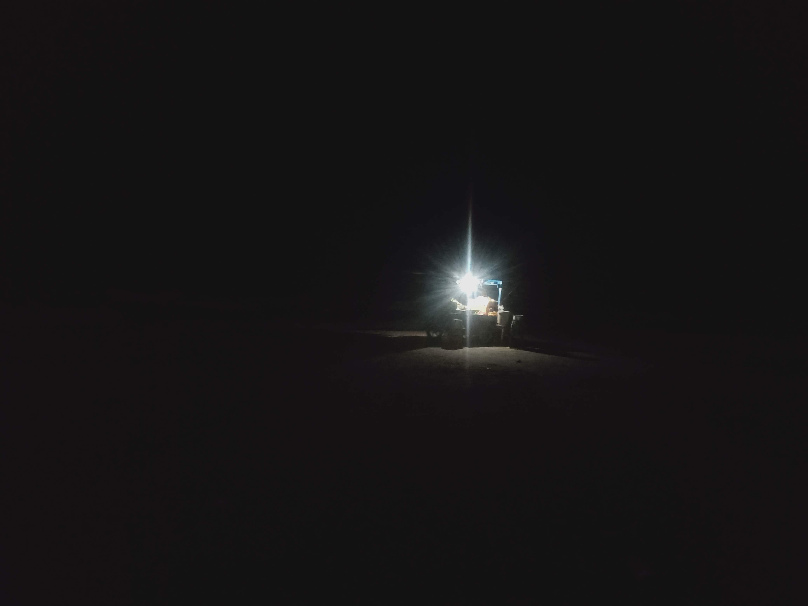

+++
date = '2024-06-30T08:34:46+05:30'
showWordCount = false
summary = 'A travelogue to Velankanni' 
showTableOfContents = true
title = 'Our Lady of Good Health'
+++

## Introduction

I recently read Confessions of a Philosopher by Bryan Maggee. The book presents the history of Western Philosophy as the author’s encounter with it. Its introduction reads something like this: 

“The book introduces the reader to philosophy and its history through the story of one person's encounter with them. So it is about ideas: the autobiographical element is medium, not message”. 

I am tempted to rephrase this introduction to suit this write-up and here it goes: 

“This write-up attempts to present stories and histories of the South Indian town of Velankanni as one man’s encounter with it. So it is about ideas, the autobiographical element is medium, not message”.

## Chapter 1: From what is to what it ought to be 
*17/11/2024* 
*Sunday*

The Sunday morning started as early as 3:45 a.m. After carelessly dumping some clothes, pen, paper and books into my backpack, I left my shelter, generally continuing the enduring journey of life and to the South Indian village of Velankanni, known for its famous Church of “Our Lady of good Health”. The residue of the previous night's precipitation had created, what my geography teacher would have called "ephemeral water bodies" on the lanes of my neighborhood. I tip-toed on the leftovers of the streets to the St.Thomas Mount railway station, the name being another residue of the tale of Christianity in India, whose re-enactment I was journeying to witness. 

The early morning silences of an acquainted locality have always been, for me, one of the definitions of the physical state of solitude. "The mass of humanity that would have traversed these spaces a few hours ago is now either exhibiting a sense of grave indecisiveness in a “life or bed” situation or immersed in the luxurious experience of one's own private reality" I observed, as I moved towards the railway station, cleverly ignoring all the possibilities of an early morning ablution in the momentary aquatics of the city streets. “The apparent absence of the enormous human activity in these spaces, seems to make its silences more sound, like the ones following storms and hurricanes or a fiery argument” I thought, continuing my walk. 

I had the first glimpse of her in the corner of the lane leading to the rear end of the railway station. She stood, caged in a glass chamber lit by a dim blue light, preserved by her own eternal chastity, holding her son in her left hand and the holy cross in her right. Her features resembled a "lost and found box" that is seen in schools. A lot of things, appearing to be equally lost, were put inside the same box. Yet, the absolute misplacement of it all did not seem odd at all, for the sheer human creativity that had put it together had indeed done a brilliant job. 

The pale, white, "European" looking features of the young charming women were hidden beneath a South Indian silk saree. Half rotten samanthi flower garlands dangled outside the glass, attempting to emphasize the “sacredness” of the statue. In the cage next to her's, lit by a red light, stood her son, older and bearded, with a mischievous looking face, carrying a sarcastic snigger. Photos of Jesus Christ and Virgin Mary were stuck below the respective glass chambers, in case you still failed to recognise who they were. 

As I stood there for a few minutes, unable to resist the temptation to write something about it, questions started pouring into my head from nowhere. Within seconds, I realized that I was having a full-fledged conversation with the multiple voices inside my head. 

“Why am I seeing statues of Jesus Christ and Virgin Mary, sculpted, dressed and decorated in a particular way, in a small lane in Chennai? Even at this hour of the day, the chambers hosting the statues are clean and well lit. I am not allowed to touch them, for they are considered to be holy. If I break these statues, it will not just be considered a legal offense for damaging public property, but an immoral act and a religious sin. What makes this statue holy? The same brick and cement that makes up the house behind these statues are not considered holy, while the statues are. The space inside the glass chamber is considered holy, while the space outside isn't. What makes the space holy? Is it sacred in itself or is its sanctity ascribed? If it is the latter, who ascribes it? Why do they ascribe it?” I asked myself. 

Immediately, I heard Dr. Surinder Mohan Bharadwaj in my head, answering these questions for me. His voice is one among the few which are permanently etched in my mind and my perception of the world. In an interview, when asked “what makes a pilgrimage place a pilgrimage place?”, he responded: 

‘Of course, all places have a character. Some places have power as their central character. Pilgrimage places have power as their central character. Where the power comes from is another issue. For some places the power may come because an event of major importance occurred over there. For some places, power may come because a lot of people have come there, set foot there and made the ground holy. There are plenty of examples for both of those. They really cannot be separated from each other. Places are powerful because we invest certain ideas with power. These ideas are related to some event that happened over there. When people come there for a pilgrimage, they want to participate in the re-actualization of the event. When they participate in the re-actualization of the event, they do so with the intention of being in the original event. In some sense, they are reconnecting with the source.’ 

‘When people do visit these places, or for example, take a particular path, by traveling in that path, they make the path holy. They also make the place holy. Because, they have come from different places and have brought many positive emotions and they create a decree of connectivity, a cosmic sort of connectivity that is not to be seen in other places. So, this place becomes specialized and more focused in the sharing of sanctity that has been brought by the people in the first place. In a sense, we are sanctifying and re-sanctifying the place.’ 

“People who do visit these spaces,” I extended Dr. Bharadwaaj’s approach, “tend to carry these spaces back home. They carry them as either their subjective experiences of the space or their inter-subjective experience of the “cosmic-connectivity” they witnessed over there. It is not just the space that is sanctified and re-sanctified by people, but also the other way around. The people become sanctified because of these spaces. The fact that a person has successfully completed a pilgrimage and returned home, adds to their sanctity and achievement as an individual. These individuals are also in some sense, considered as the manifestations of the original sacred space that they have visited. They are sometimes viewed as the wandering extensions of such spaces. Apart from this, they also revoke such spaces in new locations. The process of re-evocation may consist of a wide spectrum of activity ranging from simple conversations about their experiences there to the physical and material replication of such places. The fact that the re-evocation or the replication took place in a particular location, makes it holy as well. These spaces of replication also have a power as their central character. But, they tend to derive power by the fact that they are pointing to something more powerful, therefore worthy of that replication. On the other hand, such spaces of replication also add to the sanctity of the original sacred space as well, by extending its frontiers of power.” I paused, taking a deep breath. 

“So, the statues of Christ and Mary that I am seeing in front of me are holy because they are a re-evocation and replication of Velankanni. Nevertheless, the fact that Velankanni is being replicated in places as far as Chennai and even beyond, adds to its overall sanctity as a sacred space. These statues and Velankanni are two mutually complementing power sources” I realized. This realization left me in a few moments of silence. Whether that silence was that of emptiness or eloquence, I did not know. I just stood there, staring plainly at the statue. But the voyage had to continue, so I forcefully uprooted myself and moved on.       

As I turned around to resume my journey, I spotted another glass chamber, on the entrance of the building diagonally opposite the current caged duo under scrutiny. Inside this glass chamber stood another Virgin Mary, this time lit by a bright white LED light, supplied by "Maatha electronics" as the sticker on it suggested. "The owner of this building must have wanted their own personal copy of the universal divine" I thought, smiling at the fact that the two thousand years old, world-famous Jewish women had become the caged possessions of wealthy house owners in 21st century Chennai. 

The almost empty compartments of the Suburban train transported me to Tambaram, where I fulfilled the purpose of my morning. A fresh new spirit possessed the entirety of my body after I sipped into a few milliliters of what I called the "quotidian dose of esoteric ecstasy". People might have wanted to colloquially and colonially call it “tea”, but I decided to continue with my refraining from doing so. 

From Tambaram I took a local bus to reach the surprisingly empty Kilambakkam bus terminus. After an hour of waiting, I boarded a bus to Thiruvarur, a district headquarter in Tamil Nadu, about 35 kilometres from Velankanni. With every rotation of the bus’s wheels, I was getting closer, both spatially and temporally to reaching Velankanni, where she was venerated as the “Arokiya Matha” or “Our Lady of Health”. Indeed, the journey from the replica to the original was beautiful and merry.  

## Chapter 2: An outward enactment of an inward journey 

The bus ride to Thiruvarur felt like a “pilgrimage”, defined by my geography teacher to be “an outward enactment of an inward journey”. I was outwardly journeying towards Velankanni on a rainy Sunday morning, while inwardly reliving all those moments in my life that had something to do with that place.

I had never visited Velankanni before that trip, but had heard a lot about it since childhood. My ancestral village (Thalachangadu) was not very far away from Velankanni. My family always ensured to visit the village at least once a year. These visits always consisted of performing half-day long rituals at the local temple (the supposed deity of our clan/kula deivam in Tamizh), eating at the priest’s house and visiting a few other places nearby and returning home. In one of my earliest recollections of such a visit, I remember a distant family member tagging along with us. He was new to the village and the local Brahmin priest had decided that our man must have a two hour guided tour around the settlement. All that I remember happening for the next few hours was standing in front of random houses in the scorching sun and listening to the priest yap about the history of that particular family from their days as dinosaurs.

After what seemed like an eternal procession around the small village, we had reached a spot from where the village still continued, but our tour ended. 
“So…… This is Thalachangadu” the priest finally concluded, with an expression of immense pride on his face and his hands generally addressing the whole of humanity. 
“What’s there?” the family member asked, pointing to those few streets behind the priest’s back that we had not yet verbally excavated. 
“Ah….. Oh….. That” the priest started stuttering with a sudden and drastic change in his facial expressions that were now resembling someone’s face when their digestive system was malfunctioning.
“Those streets are inhabited by the “Velankanni Crowd”. That’s not needed for us.” he spat, with a sudden and unprecedented rush of anger and hate. From there, he dragged us back home with rapid strides of disgust, his face still emoting indigestion. 

That incident was my first impression of Velankanni. From then on, I noticed the connotation “Velankanni crowd” used even in conversations among my family members. It did not take very long for me to find out that it was a generally used terminology among Tamizh speaking Hindus (Brahmins particularly), when they had to, not quite obviously nor quite subtly, refer to Christians. The terminology seemed to be the outcome of a dicey agreement such people had between the contrasting aspects of their own personality, i,e, the nation imposed “secular outlook” and the religion imposed “intolerance”. They tend to be perpetually lost in their pursuit of balancing between these two seemingly polar forces that greatly forges and reforges their rhetoric and personality on a daily basis. 

My upbringing and culturing with such people had conjured up a very vivid image of what Velankanni might be like. Throughout my childhood, the term “Velankanni” denoted this mystical place that my fellow country folk who practiced a different faith, visited and venerated. The fact that they practiced a different faith, showed their disloyalty towards the originally “Hindu-country” and its supposedly “true” faith that birthed and nurtured them. In some sense, this disloyalty was synonymous to inferiority. Therefore, I was conditioned to look at “Velankanni” as how the wizarding world looked at the muggles in the Harry Potter series ; how musical people look at non-musical people ; how philosophers look at humanity in general and how politicians look at their own manifestos after winning the elections. 

It did not take very long for me to understand the self-contradictory arrangement of logic in this rhetoric. I noticed the argument,“ All Indian Christians are Hindu converts” to be loosely anchored around two keywords, ‘Hindu” and “Indian”. When I asked the questions, “What is Hindu?”, “What has been Hindu?”, “What is Indian?” and “What has been Indian?, this argument broke down.  

This rhetoric was, even partially valid only until I continued to believe that throughout the timeline, “Hindu” and “India”  have always existed as homogeneous entities that have interacted with “other” entities outside its boundaries. However, that was not the case. “India” as a geography may have always existed, but “India” as a geo-political entity is the product of post-independence integration of several small provinces into one whole nation. The history of this space cannot be viewed through its subsequent socio-political re-arrangements. 

I encountered a very similar problem while dealing with the word “Hindu”. I had been introduced to that word as a religion that I was born into. Therefore, I had never really bothered to question what that word denoted. When I did raise this question at some point in my life, I was confronted with several definitions to this word provided by various people dealing with it in different contexts. These definitions conveyed a vast spectrum of ideas associated with the word “Hindu”. I was unable to pin-point one idea from it to be the original “Hindu” and others to be its deviants. These ideas were not merely mental abstractions but faith-systems in practice that originated from different points in spacetime. At this point, the word “Hindu” seemed to denote an ambiguous conglomeration of a spectrum of ideas. The relationship between one idea and the conglomerative whole varied from time to time. Multiple socio-political factors seemed to have affected this relationship. Even the extents of this spectrum seemed to have remained oblivious. 

At this stage, I had read Yoginder Sikand’s Sacred Spaces - Exploring traditions of shared faith in India. The book was a collection of his ethnographies from his visits to various spaces of worship across India, which people of different religions shared and venerated. His introduction to the book problematized the very notion of “sharing” of such sacred spaces. It did so, by pondering over the parameters with which we tended to differentiate between the multiple entities that were supposedly sharing the place of worship. 

One of the fundamental questions that his introduction dealt with was “what differentiates one religion from another?”. While discussing this, Sikand wrote,”Inevitably, the formation of such collectives based on identities that are not freely chosen but inherited, leads to intergroup conflict, often overt strife, as each group seeks to define itself in contradistinction from seemingly menacing ‘Others’ “. In other words, one religious collective tends to define itself  based on what all it isn’t. So, if someone declared themselves to be a Hindu, it also meant that they were non-Muslim, non-Christian, non-Sikh, etc. As I read his introduction, I was tempted to ask, “why does this have to be this way?”. All the pages following the introduction ended up telling me that it wasn’t so. 

After reading Sikand’s book, his descriptions and narrations of instances and conversations at such sacred spaces of shared faith, I realized that “in all these instances, religion, in its contemporary sense, was but a subsequent apparatus uneasily imposed on top of existing collective endeavors of practicing faith ”. 

Till I read Sikand, I had only thought about my conception of the religion that I was born into, namely Hinduism. Only after reading his book did I start seriously questioning my understanding of religion itself. Even my visit to Velankanni was an outward search for this inward quest. 

As I was thinking about all of this, the bus continued to move steadily on top of the previous rain’s refuse. The bus stopped in Bhuvanagiri en route to Thiruvarur. A stout man boarded the bus and engulfed the seat next to mine, leaving me sandwiched between his adipose tissues and the hard metal of the bus. I gently lifted my head and looked at his eyes, attempting to ask him to budge, for I was being reduced to the size of an atom under the weight of two heavy bodies pressing against me. The moment I had a quick glance at his face, I noticed that he resembled one of the security guards at my college, who also had, very recently, told me about Velankanni. 

I was walking towards the main gate of my college. The security Anna was poised there, in front of his cabin, bending down to tie his shoelaces. He was very reflective, enabling everybody to see themselves on him. By this, I mean, not his character but his newly shaved head with the amount of oil that was just a few milliliters from competing with the gulf countries. I was walking towards him and seeing myself do so. 
“What’s the matter with your new bald head?” I asked him.
“Ahhn?” he responded, unable to hear me in the process of gradually bringing himself upright and revealing his face rather than my own. 
I pointed to his bald head and raised my eyebrows, supposedly emoting skepticism. 
“I shaved it” he responded, as though I wouldn't have been able to notice it if he hadn't said so.
“I can see that! But, why all of a sudden?” I asked him. 
“Aah that…. Fever!” he responded. 
I gave him a would-you-care-to-elaborate sort of a look.
“So the thing is….” he began after promptly recognizing my facial remarks. 
“I had two severe attacks of fever within a month’s time. Just last month, I had a fever twice. I got scared. I have a family to feed. I have a daughter. I need to get her married. My son is in his tenth grade. What will happen to them if something happens to me? So I decided to go to mother and get my head shaved.” he explained. 
“Mother? What will your mother do?” I asked him. 
“Oh…. Not the mother that birthed me….. The mother that made me” he noted, with a face that seemed to be least bothered by having two mothers.
My face emoted a huge question mark. 
“Its her. Matha….. Velankanni Matha” he responded promptly, attempting to erase the question mark. 
“I went to her and gave my hair. Now I am healthy and strong” he said, punching his left bicep with his right fist.   

After hours of coughing, the bus engine was at peace as we entered the Thiruvarur bus terminus. I got down, completing the first leg of my journey towards the holy doctor who accepted hair transactions. 

## Chapter 3: Golden saree and the missing thread 

The skies hadn’t had enough of falling for the earth. Several clouds had burst open since morning, engulfing the troposphere and the tiny Thiruvarur bus stand. My day had suddenly turned esoteric as I sipped into the last few drops of “quotidian bliss”, otherwise known as tea. Rain waters were steadily taking over the bus stand, along with heaps of garbage, smell of urine and posters of local politicians, though each at a different rate and the posters obviously being the fastest. Buses going to Chidambaram, Mayiladuthurai, Karaikal, Kumbakonam and Thanjavur were marinating on the platforms, ready to crumble like the portion of butter biscuit that had just fallen into my tea glass. 

Dogs were patrolling the bus terminus in search of food and new human friends. Huge male goats were grazing on the dustbins inside bakeries and tea shops, generally adding weight to someone’s delicious dinner. A group of boys had parked their bikes in the middle of the bus stand, obstructing the way of a bus going to Chidambaram. After honking loudly a few times, the driver bent down from the window and called out for these boys to move their bikes. In doing so, he remarked that had their parents known that they were going to give birth to such children, they would have not had sex. I wasn’t expecting to hear such a comment from the rain soaked silent bus stand. This had left me stupefied for a few seconds. I stood there, grappling with the spontaneous creativity of the bus driver and his colourful vocabulary that had been moulded into a short, crisp and powerful insult in Tamizh. 

I walked across the bus stop and boarded a bus to Nagapattinam. After twenty minutes, the bus had excreted me in a random junction along with a considerable mass of humanity that had been constipated inside it. Another bus, equally constipated, picked me up to Velankanni.  

The air smelt like salt, partially because of the evening sea breeze and mainly because of the passengers heavily perspiring. Shops selling fish bathed in different colour masalas were stacked up on the sides of the highways. Even though the bus was going to Velankanni, a famous site of Christian pilgrimage in South India, no single religion dominated the bus. Muslim families, women hidden behind burkas and the men in checked lungies occupied some seats. A pair of christian nuns were formally poised in two seats, in peach robes, white coloured head-covers and holy crosses elegantly holding onto them. A Hindu couple had joined me in their pilgrimage to Velankanni. They were heading to meet “matha” and let her know that their son is now happily married. 

“We asked her to find a good match for our son. Now, he is happily married. Isn’t it a basic human courtesy to go and thank someone who has helped us?” the husband with holy ash smeared all over his forehead and a half (which included his spectacle lens and parts of his long nose) asked me. “That’s why we left Thiruvaiyaru this morning, packing a few boxes of Idlis for ourselves” the wife clarified.         

My watch struck six when I walked out of my hotel room, bathed and fresh, ready for an evening stroll around the little town of Velankanni. The umbrella I held was struggling to protect me from the drizzling skies. The little settlement, anchored around a christian lore, was a few minutes away from floating. The groundwater table was no longer on the ground. Yet, life continued, slightly wet, but fundamentally unhampered. Shops selling raw mangoes, fish fries, puffed rice, tea and coffee were brisk in business over the carpet of the rains. Autos and bikes sailed across the streets, baptizing a considerable amount of people en route. 

I reached a small church, which I mistook to be the Basilica of Velankanni until I read the board which identified it to be the “Church built in the remembrance of the first Marian apparition”. The silence inside the hall announced its seclusion from the otherwise chaotic settlement. Two middle-aged women, white sarees ‘culturedly’ draped around them, were kneeling down to the icon of Virgin Mary holding baby Jesus, asking for milk from a local Hindu boy.   

Popular oral lore has it that Velankanni is a land of three Marian apparitions. A marian apparition is considered to be a supernatural appearance of Mother Mary to individuals. The Catholic Christian faith considers Marian apparitions to be a real and objective intervention of divine power. In Velankanni, three such apparitions are said to have occurred. 

First, to a pastoral Hindu boy, who was carrying milk to the house of a local aristocrat. As he did, mother Mary appeared in front of him and asked him for some milk for her child. He gave her some milk and carried the rest to his customer. When he reached the customer’s house to deliver the milk, he noticed that the portion of milk that he had given to the mother had not reduced from the vessel that was full till the brim. 

I sat myself down in the corner of the church and watched the same scene depicted as statues. Mary, holding her child, was almost hidden behind the golden-yellow saree draped around her. The Hindu boy was gently bowing down and offering the pot of milk. The features of the supposedly Hindu boy’s statue were particularly interesting, for it greatly matched the stereotyped image of a medieval Brahmin boy. His long hair (shika) was tied into a knot. Three horizontal lines of holy ash were smeared over his forehead, accompanied by a small dot of saffron. A veshti, additionally held by a red towel tied around his waist, was covering his body from his hip till the cuff muscles. Above all, his complexion was very fair. 

However, the key feature that declared any male to be a Brahmin, the holy thread (yagnopaveetha) dangling across the chest was absent. This to me, seemed deliberate. “Like the ‘Velankanni crowd’ connotation, this seems to be a Christian way to not so obviously, but not so subtly either, refer to Brahmins” I thought. But, the statue of the boy reflected a lot more than this obviously partial reference to the Brahmins. It stood there, retelling me the story of Christianity as it presently manifests in South India, its multiple players, practitioners and pensive minds involved in its propagation.  

One of the earliest ambassadors of Christianity to reach India was St. Thomas, an apostle of Jesus Christ, who is believed to have wandered the southern parts of the subcontinent. After him, several small-scale Evangelical missionaries have reached India and have acquired fresh converts for their faith. However, the spread of Christianity in South India acquired a new boom only in the early seventeenth century. One of the instrumental characters that popularised Christianity during these times was an Italian Jesuit by the name Roberto De Nobili. 

De Nobili, as Sikand describes him, “seems to have been a volatile, yet a colourful character, with a flair for languages and a characteristically Jesuitical dedication to the holy cause of expanding the frontiers of the Church of Rome”. He settled himself down in Madurai, a famous South Indian town and began his missionary work. It did not take him very long to realize that the Tamizhs, his primary prospects, were considering Christianity to be an alien faith and showed very little interest in converting into it. After this daunting discovery, he notoriously re-established himself as a learned Brahmin, wearing the holy thread and sadhu like kavi robes. He also adhered to their practices of purity and pollution in their treatment of the low caste and denounced meat eating. He mastered the Sanskrit language and started preaching in a highly Sanskritized Tamizh. He wrote several essays in a highly Brahminical Tamizh that attempted to integrate Vedantic and other Hindu thought systems with Roman-catholic theological doctrines.  He laid the foundations for the creation of what was later to be called “Brahminical Christianity”. De Nobili is sometimes referred to as the “Roman Catholic Brahmin”.     

However, very few Brahmins actually converted to Christianity. Many refrained from doing so, mainly because their positions of power and privilege were closely linked to Hinduism, its customs and practices. On the contrary, many dalits and shudras started converting to Christianity during these times. These converts are often referred to in the missionary circles as ‘rice-bowl christians’, who agreed to be baptized in exchange for a bowl of rice. To them, conversion to Christianity was also a means of rebellion against the existing oppressive social order that treated them as untouchables who are inherently impure and inferior. 

As Sikand writes, “with an ever-increasing number of Dalit and Shudra converts, the church itself underwent a gradual transformation. Catholic places of popular pilgrimage sprung up, promising miraculous cures to mysterious illnesses. Great visual displays and theatrical performances such as chariot processions and demon exorcisms, festivals of fiery light and throbbing devotional music, all these readily appealed to the ‘low’ caste, for whom the sombre, staid ritualism of both the Brahmins and the Church of Rome were equally alien”. 

Therefore, the partial reference to a Brahmin boy in a christian lore situated in South India seemed to me, no accident or coincidence. At the foundational level, a Christian lore narrating the story of a Hindu boy being blessed by Mother Mary seemed like a trope to emphasize the benevolence of the deity, that supposedly transcends the human-made boundaries of religion. However, the situational context of such a story reveals to us a far more complicated picture of its tellers and listeners. 

The lore and its multiple depictions seem to show us a very tainted image of Christianity’s encounter with South India. The Brahmanical Christianity that developed during Nobili’s times was later denounced by the growing number of Dalit christians, to whom Brahmanism and Catholicism were equally distant. In the process of mitigating this distance, indigenization of sorts seems to have taken place, manifesting as Mary draped in a South Indian silk saree and her appearance to a Hindu boy with particularly Brahmin-like features, who loses his holy thread. 

With all this running in my mind, I walked out of the Church to see Virgin Mary, the benevolent local guest in her home. 

## Chapter 4: What is it that I know anyways?

The gateway of the heavens was wide open when the gushing sea breeze was yearning to put me into one. Drizzles cleansed the Church complex, making walking and gliding almost indistinguishable. A tiny mass of humanity was creeping over the massive structures of the Basilica of Our Lady of Good Health in Velankanni. The landscape of Christianity was dotted with earthlings that were being moved by divine power alongside its earthly sanctions. The presence of every human in the sacred space validated the other’s, fostering a universal humane connectivity confined by the semi-porous boundaries of religion.

Every foot that walked the land was making the land holy. Every spine that bowed before it was making the cross holy. Every hand that gripped Mary’s feet was adding to her never-ending list of miracles. Every mouth that uttered the name of god was painting its oral picture. Every drop of tear that was shed graciously multiplied the volume of the divine ocean on top of which the church was floating. 

The gigantic speakers amplified the horrendous voices that were chanting the name of god. Little children, still innocent to the conception of a god, were running across the massive church hall, followed by their own screams and their parent’s; some who regretted bringing them to the church, and some who regretted having them in the first place. Families huddled together in the benches of the Church, collectively seeking the mercy of the lord. Tamizhs walked into the Church, joining with the amplified chants of the speakers. Mallus walked into the Church, some bravely confronting the threat of slipping on their own coconut oil reserves. Konkanis, with their extravagant costumes, found their seats in the massive setting.

Mother Mary, consumed by the South Indianness that engulfed her, stood behind the altar, sustaining her charming benevolence. The relatively new chapel on the western side of the Basilica reverberated with all these diverse noises that together produced the unifying sound of Velankanni. A white and golden palette dominated the interior design of the chapel. Wooden benches, following the Catholic originality, were neatly arranged into two rows. The extra plastic chairs that were supposed to host the ever increasing population of pilgrims, were scattered all over the place, appearing to represent the complexities of Catholicism in practice. Humanity that wiggled through all of this, carried the essence of the faith.  

A barricade near the altar separated general humanity from the Jesuits training under the Church, who were carefully enveloped in their black and white robes. A mischievous looking middle-aged man walked onto the raised platform near the altar, cleaning it for the next mass. Behind all of this stood Velankanni, like a silent witness to everything, alongside her beloved and bearded son Yesu. 

An old woman, the ripples on her skin marking her endurance in matters like existence, was seated in a wooden bench before me. Her hands, shivering presumably of old age, held on to what I was tempted to call the autographed copy of the Holy Bible. Her deep red eyes, overflowing with tears, gently scanned the pages of the scripture. The only things she seemed to see were the Bible in her hand and the Virgin behind the altar.  Her glance shifted from one to another, every time with a fresh smile of excitement and a new drop of tear. She raised her hands at times, graciously summoning the divine. She was, according to me, immersed in the profound experience of an assumed state of true vulnerability and frustrated hope. 

The pale white saree that she had thrown around herself reminded me of a verse from the Kamba Ramayana:  
> &emsp;&emsp;&emsp;&emsp;&emsp;&emsp;துப்பினால் செய்தகையொடு கால்பெற்ற துளி மஞ்சு 
> &emsp;&emsp;&emsp;&emsp;&emsp;&emsp;ஒப்பினான் தனை நினைதொறும் நெடுங்கண்கள் உகுத்த 
> &emsp;&emsp;&emsp;&emsp;&emsp;&emsp;அப்பினால் நனைந்து அருந்துயர் எயிர்ப்புடையாக்கை 
> &emsp;&emsp;&emsp;&emsp;&emsp;&emsp;வெப்பினால் புலர்ந்து ஒரு நிலை உறாத மென் துகிலாள் 
> 
> &emsp;&emsp;&emsp;&emsp;&emsp;&emsp;tuppinAl ceytha kaiyoDu kAl peRRa tuLi manju  
> &emsp;&emsp;&emsp;&emsp;&emsp;&emsp;oppinAn tanai ninaithoRum neDungkaNkaL ukutta 
> &emsp;&emsp;&emsp;&emsp;&emsp;&emsp;appinAl nanaindu aruntuyir eyirppuDai yAkkai 
> &emsp;&emsp;&emsp;&emsp;&emsp;&emsp;veppinAl pularndu oru nilai uRAtha men tuhilAL 

Her longish eyes overflow with tears that wet her fine clothing (saree) as she thinks about him (Rama in Sita’s case and Yesu in the old women’s case), who is compared with the black cloud that has arms and legs made of pearl. But, the wetness immediately dries due to the heat that her body emits because of the intense sorrow, thereby alternating between wet and dry accruing an uncertain quality. 

I walked out of the chapel retaining my smile and the vivid mental images of the situational Sita.  I visited the brightly lit shopping complex in one corner of the Church compound, which claimed to sell ‘Spiritual books’ and ‘Religious items’. A thoughtful stroll led me out of the compound of the Church, onto a crowded market street that was discharging pilgrims into the sea shore at the other end. Extravagantly lit shops selling candles, puffed rice, pilgrim accessories, clothes, slippers, flowers, fancy watches and phone accessories were lined up. Tattoo studios made guest appearances between some of these shops. Apart from all this, Barber shops, with fancy banners containing bald photoshopped images of Tamizh film-stars did not fail to induce a comical chuckle amidst an otherwise chaotic marketplace.  

Pilgrims and tourists walking on the street resulted in the casual excavation of the actual thar road buried beneath the filthy humus of modernity. This justified the considerable stink that was an inevitable part of the commotion. My locomotion came to an abrupt halt when I found myself meters away from a receding wave. A quick instinctive jump prevented a layer of ocean water intimately blended with pilgrim refuse from embracing my physical self. I looked back to realize that local trade had conquered a territory that extended till the brim of the land leaving no room for an open beach. 

The reddish full moon had risen from the verge of Bay of Bengal. The eastern skies and the ocean waters had acquired a new glow. The noises of human life suddenly sounded distant due to the magical charm of the roaring sea. Artificial lights actualizing nightlife in Velankanni were gradually disappearing as I kept striding towards the empty extents of the beach. I was in search of some silence and proximal distance from the commotion of the town. I walked through shops selling sea food that were lined up till the edge of the seashore, probably trying their best to serve the freshest fish possible.

In one of these shops, “Arogya matha seafoods” as its banner proclaimed, stood a man frying fish. Beads of perspiration were cleansing and re-cleansing him. His saffron cloths holding onto him, sandalwood paste that seemed to have exploded on his forehead, his phone speaker effortfully playing Ayyappa Bajans identified him to be a devotee who had vowed to visit the Ayyappa Temple at Sabarimala and wore the holy garland as a marker of this endeavor. With the intricate strokes of his knife, he slashed the outer skin enabling the masala to penetrate into the inner extents of the fish fry that he was preparing. The order was placed by a Catholic Christian family from Goa who had come to Velankanni for their usual annual pilgrimage. “How complex can religion in India get?” I thought, witnessing the happenings of the scene.

Accompanied by a dog that I had decided to call Jango, I marched past the last artificial light-source on the beach, a pushcart selling “Masala Pori”. The dark voids of the seashore kept revealing itself in every step I took towards it, like the uncertain futures becoming a concrete present. Winds were waging a war against gravity, making my position on planet earth very dicey. I sat myself down in a secluded spot on the beach. It did not take very long for the physical seclusion to become an integral state of solitude. Tears rolled down my cheeks for no apparent reason. I tried singing for a while, attempting to console myself. Music has helped me at times when my articulatory spirit has been dampened by the tears of ecstasy. But this time was different. The density of the tears had soaked the music as well, making it sound like a calf with sinus mooing at its mother. I had stopped singing.  

Images of the situational Sita I had met inside the Church hall flashed in my mind. 
“What was she experiencing to be able to weep like that for hours together?” I thought. 
“Was she crying to god or for him?” 
“Or, was she just crying and the Church hall that surrounded her happened to be a coincidence?” 
“But, she held an ancient looking copy of the Bible. So, she must have planned to come to the Church.”
“In that case, what could have caused her to cry like that?”
“Would she have ever doubted the existence of that god with which she was investing several ideas and an astonishing volume of emotions?”
“Does she, with utmost certainty, believe in the existence of a god who will answer her tears?” 
Does she even need a god, or a rational proof of its existence to be able to weep like this for hours together?” 

The moment I asked this question, I heard a conversation with my social science professor, replay from within: - 
“Do you believe in god?” I asked.

“I do not believe in the existence of god. But, I certainly do believe in the power of a myth.” he responded.
Noticing that question marks suddenly dominated my facial expression, he continued to speak, 
“Why does something have to exist for me to believe in it?
I do not believe in the existence of a god with extravagant powers, sitting somewhere in the heavens and controlling the world that I live in. I know that the idol inside the sanctum of a temple is just a portion of a boulder carrying an exquisite piece of art. But, I can still be deeply moved by it, by singing songs for it or just by silently sitting in front of it. I can weep for hours together just by witnessing the faith scape that surrounds it. At times like this, I need no rational proof of the existence of god. Even love is like that. Love is a mutually agreed myth. You know the power of love. If two people strongly believe that they are deeply connected with the other person, it is as good as the connection existing in reality. So, no, I do not believe in the existence of god. But, I have learnt not to underestimate the power of a myth. I need not know that something exists for me to believe in it.” he concluded

“What do I know anyways?” I asked myself, as usual, building onto the residues of past conversations in my mind. 

“I believe there exists a reality irrespective of my perception of it, ‘the objective reality’ as they call it. Can I ever know this reality as it is and not as I see it to be?” 
“I constantly experience this reality, ‘the subjective experience of an objective reality’. Do I know the contents of my experience? Do I know the essence of my experience? Do I know the nature of my experience? Can I know all of this?”
“I believe I know who I am. But, every time I am profoundly confronted with the question ‘who am I?’ I am always tempted to say, I wish I knew. But, I still believe that I am something. I do not know what, but I believe I am.”
“I continue to believe in all this, at times consciously, but mostly unconsciously without me having to know any of this to be a certain truth.”
“I carry a long list of things I believe in without knowing if it exists or not. If God can be graciously part of this long list, sure, why not?” I thought, staring at the verge of the sea.  

## Chapter 5: The eternal waiters 

The atmosphere had just broken up with the stratosphere. She was unable to handle the sorrow. She wept and wept for hours together leaving me strangled in my hotel room. I was up and ready by 4 am, wanting an exclusive glimpse of Velankanni before the rest of humanity. By the time I left my room, it was ten minutes past six. A glass of “divine concoction”, tea in other words, esoterically fueled my stroll. I walked past the gigantic structures of the Holy Basilica, drenched after a dramatic atmospheric baptism. 

I was heading to a locality named Tsunami Nagar, a village built to rehabilitate the local fisherfolk who had lost their homes due to a Tsunami that occurred in 2004. Twenty years had passed since the wrath of the ocean had forever taken away their houses, loved ones and all their life-long possessions, from the people of Velankanni and several others who lived in the South eastern coastline of India. ‘December 26, 2004’, a mere mention of this date to the locals of Velankanni could conjure very vivid and horrific images in their mind, that continued to haunt them even after two decades. 

“What made her angry? I do not know. One fine day she erupted and took away everything we had to call our’s.” said an old woman as she helped me find my way to Tsunami Nagar. Indeed, the disaster had left a massive invisible scar in everybody who had lived to tell the tale. A mere prick could cause terrible pain. 

It was the day after Christmas. As usual, pilgrims from all over the country flocked the tiny coastal town of Velankanni. The celebrations of Christ’s birth had come to a merry conclusion for the 2004th time. Taking a dip in the beaches was an integral part of the pilgrimage to Our Lady Of Good Health. Thousands of them were gathered on the beaches to complete this leg of their package before concluding their Christmas pilgrimage. All of a sudden, as though refraining from offering a dip, the sea water retarded, exposing the seafloor. South Indians, who had not witnessed a Tsunami in a long while, did not know what this meant. Many are said to have considered this to be a miracle of Matha who they thought was pleased by their Christmas prayers. Hundreds followed the retarding sea, wanting to witness the spectacle in close proximity. Within seconds, a gigantic tide erupted from the sea, permanently erasing a portion of humanity and its attributes from the surface of the earth. 

Two tsunami waves hit the coast that day. A few people managed to hold onto something and float to the Basilica. They managed to lock themselves inside the Church hall before the second wave hit the town. At that point, Matha was the only one inside the Church hall who had decent expertise in dealing with Tsunamis. 

Sometime in the 16th century, a Portuguese ship sailing from Morocco to Sri Lanka was caught in fierce weather. The sailors are said to have invoked the aid of Mother Mary, under the title, Our Mother, the Star of the Sea. She is said to have appeared to them as a blob of light, helping them find the nearest coast for safe harbour. The entire crew, roughly around 150 people, are said to have safely reached Velankanni. As a thanksgiving, the Portuguese sailors rebuilt the Chapel, currently believed to be the eastern Chapel of the Basilica. This is the story of the third Marian apparition at Velankanni. The Tsunami of 2004 was not the first time when hundreds were saved from the wrath of the ocean by the Star of the Sea. 
I walked through the material residues of all these stories, in search of some of its retellers. I floated through several streets, arrayed with secular arrangements that aided the functioning of a religious pilgrimage site, to have a glimpse of a Velankanni beyond it. The life within the town kept revealing itself. Not the life that came and went, but the life that stayed and lived. 

Hotels, dilapidated buildings overlooking the sea and proclaiming to be beach resorts, lodges and guest houses gradually gave way to fisherfolk settlements. Rows of thatched huts, asbestos roofs and primitive concrete structures, all subsumed by the strong aroma of dead fish, started exhibiting themselves. Boats were parked on the sea shore with men who had parked themselves on it. Alcohol was served in plastic cups while a stylish fisherman slashed his knife through a raw mango, the essential delicacy to add to hours of intoxication. The Bay of Bengal was endlessly extending in the background.

The sun was launching itself from what appeared to be the extent of the sea. Silhouettes of thatched roofs adorned the shore. Women, driven by an entrepreneuring spirit, were selling what I presume to be their family’s catch for the day.  A stout woman, the drapery of her saree reemphasizing her charisma was seated in the middle of the setting, making it hard to decide whether she anchored herself in the centre or the scene had painted itself with her as its center. Even seasoned bargainers were no match to her commanding tone. Her buyers were demanded to pay what she asked of them. Hers was the thatched roof in best condition among others raised on the beach.  Other women, elegantly seated under their own roofs were not even trying to compete with Our Lady Of Good Fish. 

All of a sudden, a young boy, probably in his late 20’s, wearing a dirty yellow glove, pounced to the middle of the scene, carrying a bucket of prawn. Following him came another man, slightly older, carrying a big plastic sheet. His nudity was exposed to such an extent where his checked lungi seemed almost useless. Mr. Reveal-it-all and Mr. Yellow-glove set the stage for the auction of the fish. An old woman, who I was tempted to identify as Eve’s best friend, chaired the auction. Soon, crowds gathered around corpses of prawn, loudly calling out the current highest bid. 

All of a sudden, the hero of the scene arrived in his bright blue Dio bike, with his assistant who, from the moment they got down tip-toed right beside him, was on his mark awaiting his master's orders. His master, presumably a local politician, ordered him to enquire about the current bid. Before he could even answer, “whatever it may be, tell them that I will give an addition of rupees 2000 from that price” roared the master’s voice. The auction was called off and the prawns proudly headed to suffice an expensive hunger.

As I stood there watching all this, a middle aged woman walked up to me. 
“Why don’t you buy something from the auctions?” she asked me, probably after spotting an unproductive person in the busy business setting. 
“I am from a different town. I won’t need this much fish” I responded. 
“Who asked you to eat it? If you sell it on your way, you might earn your travel expenses” she suggested. 
“Not a bad idea” I thought, but too late, she had already walked away. 

The silence following the enormous tides continued to sink Tsunami Nagar even after two decades. The settlement was neatly ordered, showing no explicit signs of excitement towards the endeavour of existence. Life in Tsunami Nagar seemed despite the howls of a horrific past echoing on a daily basis. 

“Who is that? Who has come at a time when my husband is not at home?” commanded a voice, as ambiguous as its source. I stopped my stroll in one of the silent streets of Tsunami Nagar, generally waiting for something to happen. An old woman walked out of a thatched hut. 
“That was my daughter-in-law. She still thinks that her husband has gone to the sea (for fishing) and will return sometime. But, he was taken away by the Tsunami. My daughter-in-law has not accepted this. She has gone crazy trying to do so.” she said. 

I do not remember how I reacted to this. 
“Please do not mistake” she added, with an apologetically arranged facial expression. 
“Why would I mistake this? I totally understand the situation. Please take care of her and please take care of yourself too” I said, not knowing how else to respond. 
She stood there silently, undergoing a similar struggle as I was. 

I peeped into the little door of the hut, wanting to have a glimpse of the eternal waiter. She was seated on the remnants of a straw mat. First impression told me that the idea of cleanliness was very alien to her. She was frighteningly hidden beneath several layers of dust. Her brown hair was carelessly held by a knot. She was wearing a purple nightie containing stains of a few decades. Her repulsively red eyes and lips demanded attention. 

I was tempted to tell her that “Just last night I was sitting on the beach thinking about my social science professor telling me that love is a mutually believed myth. So, if you strongly believe that your husband will return to you someday, continue doing so without worrying about the logical possibilities of it happening”. 

“But, she probably has more conviction in the idea than I do” I thought. “I just got there yesterday, while she has been doing this for almost two decades. Who am I to reassure her?” I realized. 

“At the end of the day, the functional end that a belief serves does greatly strengthen the conviction of the believer” I thought, walking back to Velankanni from Tsunami Nagar. 

After a few hours of loitering around Velankanni, visiting the Matha Kulam church, St. Antony’s Church and several others scattered around the town, I got back to the Basilica. I wanted to have one last glimpse of the Church before I left the town. 

The hall was overflowing with pilgrims gathered for the morning mass. A young priest was conducting the mass. I could not find a space inside the Church, so I had to sit near the entrance.

“Two thousand years have passed since Christianity reached India. But, we still are just 2% of India’s population. This tells us that we still haven't understood the importance of Evangelization. We have not understood the meaning of it. It is the virtue of every Christian to show the world the true faith. It is our duty to Evangelize. We must liberate the masses from their plight and sorrow. We have not done this enough. Let the world know that there waits a god by the name Jesus Christ, waiting to shower all his blessings from the moment of Baptism” the voice of the young priest, amplified by the massive speakers of the Church, announced. 

Throughout the discourse, the vivid visuals my mind conjured up were a little too hilarious, taking me dangerously close to laughing inside the Church. 

“At the end of the day, the commodity of gods sold at the market of religions is what it is made to become at the outset of things. Whatever may be at the depth of a faith, firstly it must attract the customer as a profitable deal” I thought, walking to Velankanni bus stand to board my bus to Chennai. 

“I too have become an eternal waiter, forever longing to revisit this town ” I thought, cherishing every moment of the last 48 hours, as the wheels of the bus moved out of the little town of Velankanni

