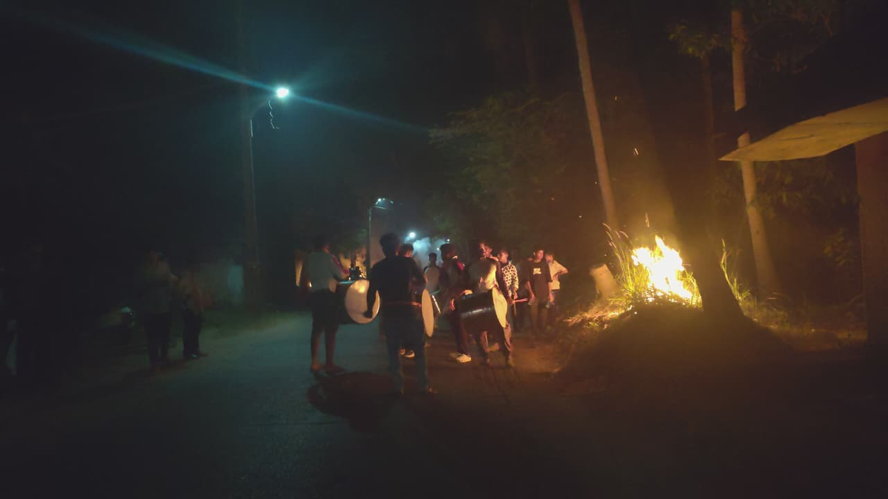

+++
date = '2025-10-20T13:41:02+05:30'
title = 'The Vessels of God'
showWordCount = false
showTableOfContents = true
description = 'Entries from Udupi'
summary = 'Entries from Udupi'
+++

## Chapter 1: Art - The Absurd Ambiguity

The remnants of what was once a KSRTC bus carried us towards the Arabian sea through the Western Ghats. The highways of Karnataka that seeped through the hill range were constantly proving the law of inertia. The bus driver was treating the steering wheel much worse than extremists treating historical narratives, twisting and turning it to aid his momentary aspirations. 

Accompanied by a friend, I was on a week’s mission of generally grazing around the coastal towns of Karnataka. Throughout the trip we were doing what V.S. Naipaul describes the law courts of Pakistan to be doing after every Namaz bell; moving from a state of doing nothing to absolutely nothing. 

With pairs of headphones gently clinging on to our ears, we let music expose the essence of our realities. At some point in the ride, we resembled coconut trees during a storm, swaying violently, partly to the music and mostly due to the bus driver treating the steering wheel like a DJ board. The magical moments in the voyage were those when the shared and the personal journeys coincided in some sense or the other. This included things such as the plastic flower garland dangling near the windshield moving in sync with the rhythm of a song or some random child on the bus smiling at the very moment when the melody of a song starts to make you feel like levitating. The journey of life with the commentary of music made even the supposedly mundane things seem intensely passionate.

While reality kept revealing itself to the charms of human-made sounds, a hand patted my shoulder. It was my friend, asking me to remove my headphones. The obvious signs of a trance, the inevitable accompaniment of good music was explicit on his face. “I….. I have a question” his voice uttered, visibly struggling in the process of reorienting with the environment after a musical hurricane. 

“It is said that we human beings were either created or we have evolved into our present state over the span of some years in the history of this planet” he began the question, his hands beginning to paint the air dramatically. 

“There are things around us that are said to have been here much before us or much before we became something close to what we are today. Trees, plants, mountains, rocks, soil; these things have been here for a much longer time than we have. Somehow, we have understood these things”

“Understood? What do you mean?” I interrupted.

“Understand….. .Well, not completely. We have understood these things at least functionally. We have learnt to use the bark of trees and make useful furniture. We have learnt to use soil, make bricks out of it and build houses using them. Do you get what I mean? We have understood what these things are and can be used for. But art, something that is fundamentally understood to be a human creation, seems to be completely beyond even our functional understanding of stuff” he paused, promptly sensing my “what-do-you-mean?” look.  

“Why do we need art? We don’t know! But, it is an intimate part of all our lives. Isn’t this absurd?” he exclaimed!

“Not really, I think we all know that. We all know that if we begin to question the purpose of art, sooner or later we reach a point where we say we don’t know. Entertainment, expression of human creativity and bringing people together are some answers we procure as we move towards that point. But, beyond all this we can only say we don’t know and we all seem to know that” I said, with a broad smile. 

“Exactly! 
What is art 
We don’t know! 
What is not art 
We don’t know either 
Why do we need art 
We don’t know! 
Where does our art come from 
We don’t know! 

We just don’t know anything at all about art. Yet, it is an inevitable part of all our lives. We all actively participate in the production and experience of art, without knowing about any of this or even bothered by it.

There is a door in our house. We know it comes from a tree. We have bricks in the wall. We know it comes from soil. We have rice and we know it comes from a plant. We have clothes and we know it comes from cotton. We also have art…. But, we don’t know where it comes from! We hum random tunes. Do we think about where they came from? People sketch stuff. Where was the art before it was sketched? Why did the person bring something from somewhere and sketch it?  

We human beings who know something about the things on the planet that have existed before us, have absolutely no clue about something that is fundamentally our own creation. Is it because of the enormity of art or the incapacity of the human mind to comprehend its own creation?” he asked, gradually letting language seep through the silence following the musical storm. 

“What were you listening to?” I asked him, trying to identify the actual culprit behind this ramble 
“Beethoven…. 6th symphony…. 5th movement…” he stuttered, like a guilty criminal confessing his crimes 
“No wonder” I thought. 
“Beethoven has triggered your Socratic spirit” I remarked. 

“I was right here, sitting next to you on the bus” he continued, unapologetically ignoring my comment which I still consider worthy of a gentle chuckle if not hours of sustained laughter.

“I put on my headphones and played the song. But, the music took me somewhere. For a moment, I forgot that I was sitting on this bus that is taking me to Udupi, along with my friend with whom I had planned this trip a month ago. I forgot all about that! I forgot where I am, what I was doing and who I am in the first place. The music took me to a place beyond all this. I don’t know where or how. But, I know it happened as much as I have no clue about its how(s) and why(s). My immediate question after the experience was, can I ever know about all this? Can anybody know about this? Let’s say, I gather all of humanity and ask them, where do you guys go when you listen to good music? I don’t think anybody would know!”

“You know, this has been my only source of reassurance after such experiences. When art takes me somewhere, to the realm of the unknowable so to speak, my only source of reassurance after that is the fact that it remains unknowable to everybody. That makes me feel like we are all in this together, trying to figure it out, trying to understand where art comes from and where it takes us” I said, smiling rather sheepishly.  

“Yeah….yeah. We all seem to know that we don't know a lot about art.  We all seem to be aware that the fundamental premise of art is quite obscure. Yet we engage with it, more freely than most other things in life. We have developed objective parameters to distinguish good art from bad art, when we don’t know what art is and where it comes from in the first place. This seems absurd.     

Yet, the absurdity does not make art seem like a pointless endeavour. On the contrary, it validates its presence for me. Somehow, it is precisely this absurdity that makes art all the more attractive for me. Isn’t this absurd too?” he concluded. 

Then, he put on his headphones and continued listening to music, completely oblivious to the fact that he just finished delivering a sermon on art and its absurdity.   

As much as the entire sermon was an intrusive ramble, the question that it fundamentally raised was profoundly disturbing. In the sphere of human life, the role that art plays seems to be obscure beyond a certain degree of reasoning. It accompanies humanity in almost all of its endeavors. The luxuries of affluent societies are spent in art creation. The adversaries of human life are fended off by art. Yet, what art really does here is a question that remains devoid of a reasonable answer. We tend to take this for granted like most other unanswerable questions that we are confronted with. Otherwise, this premise leads us to confront the daunting pointlessness of what we consider to be one of the most creative expressions of human life.

## Chapter 2: A Little Too Strange 

After a few hours of cascading through the western ghats we got out of the dead bus that had found itself a grave in one corner of Udupi bus stand. The residue of good music and the subsequent ramble seeped through our body systems, making us feel slightly more alive than usual. After helping ourselves with what seemed like a “last supper” table full of Udupi tiffin, we generally started wandering around the town. Comical imaginations of Krishna, Madhvacharya and their bhaktas were found all over the place, alongside some unfathomably tasty bonda(s) and masala dosa(s). The number of languages that one heard throughout the settlement was a consistent marker of its cultural diversity. 
 
Tamil speaking shopkeepers were selling devotional accessories. Kannada speaking policemen were directing crowds. Tulu speaking boys were sitting on top of compound walls, playing violent video games on their phones. Telugu speaking families were arguing their way around the settlement. An almost eccentric group of Malayalam speaking college students were pacing towards the Krishna temple, engaging in collective noise production. Rajasthani travellers had parked their buses in what they thought were the sides of the road and started flipping their chapathis in the middle of the traffic. Some Marathi and Bengali families were also loitering around the place.

Russians, Europeans and Americans who had converted to Hinduism were propagating the activities of their missionaries, calling out random strangers and politely reminding them that their souls are eternal. 

We walked through all this, trying to view and comprehend a miniscule portion of the complex human activity. In between this venture, we sat ourselves down in a restaurant, in order to refuel our abdominal cavities for the next leg of the exploration. Concoctions vaguely resembling tea and coffee were served, along with some undefinable evening snack disguised in hot oil and abandoned in a lake of coconut chutney. My friend was carrying a tripod which he had placed on top of the table in order to free himself of all possible baggage while indulging in the obnoxious meal. 

“Sir, eeeeeeh, what…what…what is that? Tripod eh?” asked a voice, with an accent not as urbanised as the outlook of the speaker. 
“Yes sir!” my friend replied. 
“See… I have a youtube channel. That’s why I am asking. How is it? Is it convenient to hold? Are the videos any less shaky?” the man asked, camping inside his loose blue t-shirt pinned to the table adjacent to ours 
“Yes yes. It is very convenient to hold onto. I have been using the tripod to capture timelapses mainly” my friend replied, smirking, perhaps at the unexpected acknowledgment for his cinematic endeavours. 
“How much did it cost?” 
“Around 300 to 400 rupees 
“Is that it?” 
“Yes yes. Do you want it? Take this if you want” my friend offered, handing the tripod to the stranger. 
“No no! I just wanted to enquire” he replied, showing the first signs of a smile, though a very sheepish one. 
The very next second, urgently rearranging his posture, he turned to the waiter who had parked himself in the table next to our’s and started commanding in Tulu (a local tongue). 
“What are you staring at? How can we talk if you keep staring at us like that? Move aside. We are trying to have a conversation” he ordered, his voice sounding unprecedentedly sharp and cold. 

The conversation continued only after the puny waiter hesitantly moved away from our table. The stranger introduced himself to be a digital library keeper by the name Anish K (pseudonym of course). He then asked us about who we were, what we were studying, the purpose of our visit and what our plan was for the evening. 

“Nothing much! We have been going around Udupi. We went to the Krishna temple in the morning and then walked all around the place, munching on a lot of edible things. Now we are planning to go to Malpe Beach in the evening. That’s it” my friend replied reluctantly, facially emoting skepticism towards the questioner’s emphasis on wanting to know the details 
“Malpe! Yeah, that’s an interesting place! Mmmhhh….” he said, sounding like a classical musician trying to find his pitch 
The silence following what sounded like an inaugural note of a concert seemed intended by both its custodians. 
“Do you want to see a Kola?” Anish asked, calculatingly fracturing the silence. 
For a moment, I could not help but imagine a cute little Australian bear jumping onto the table, for his pants looked suspiciously loose 
“That is not going to happen” I reassured myself 

“Just a moment ago, I was texting my friend from Udupi, asking her if she knew something about the Kola. Yes yes, we would love to see it” my friend replied on behalf of the two of us, as though he was intuitively aware of my intrinsic interest in looking at small-sized vegan bears. 

“What are you talking about?” I wanted to ask but it was too late! 
“So, the Kola is happening in a place called Babbarya Pade, near a village called Kalmadi. It is my native. The deity is my kula daiva (the deity of a clan). The kola is for him. It starts at around ten in the night and goes on till early morning. You can take a bus until Kalmadi and then walk to the hill. Pade in Tulu is hill, so Babbarya Pade is the hill of Babbarya. He is the daiva. Today, the kola is for him” Anish lectured, giving us the directions and a crash course in local geography and history.  

Before either of us could respond, he continued 
“So, the Kola is a very sacred thing. This time of the year, December to March, that’s the season. A lot of Kolas are happening in and around Udupi today. Babarya Pade is in my native village. That is why I am inviting you there. You said you liked cinema and you also liked Kantara. Right? Come here tonight. You can use your tripod and click a lot of photos” he suggested, finally addressing the object that stimulated the entire conversation.

The moment he mentioned the film Kantara, I knew what he was talking about. He was inviting us to a bhoothakola, a shamanistic ritual practice prevalent in the region of Tulunadu. Shamanism is a term that denotes religious or spiritual practices that typically involve a practitioner interacting or embodying spirits through altered states of consciousness, such as a trance. The bhoothakola is a practice that involves a kola dancer getting possessed by the daiva and then interacting with the people of the village, granting boons and addressing their queries. This practice has a long history and is an important symbol of their culture for the people of Tulunadu. The recent Kannada film, Kanthara had summoned unprecedented international attention to this practice, becoming the contemporary symbol of this age-old tradition.  

“Will you guys come though?” Anish asked, suddenly sounding very polite 
“I usually don’t invite people to this ritual because they tell me they would come and never turn up” he remarked, getting up from his chair 
“Don’t worry. We will definitely come” my friend replied. 
“See you in the night then” he said, after giving us his contact information, smiling as he walked out of the restaurant. 

“So what do we do?” my friend asked me. 
“What do you mean, what do we do? You just told him that we would come! 
“Yeah, that was part of the flow of the conversation! Now you tell me! What do we do? Do we go? 
“I don’t know!” I exclaimed. 

The evening that followed was spent in the hypothetical analysis of the million possible ways in which the evening could go wrong. 
“Do you realize that he is an absolute stranger? We haven’t seen him before. We don’t know if we will ever see him again. How can we just trust him and go there?” I asked my friend. 
“Why not? What do you think will happen?” he enquired, equally indecisive. 

“I don’t know!” I exclaimed. 
“Maybe he wants our kidneys” he suggested, after contemplating for a few hours.  
“What the hell! Why would he want our kidneys?” I asked indecisively, also about whether or not I ought to be crying or laughing at the premise of our discussion 
“Well, he saw us drink the tea and coffee from that restaurant. He probably thought, if their kidneys can deal with that, it can deal with anything” he suggested, with unwavering conviction in his proposition 

## Chapter 3: The Formless Takes Form

 

After a few more hours of being as indecisive as the wipers on a windshield, we finally arrived at Babarya Pade at around 10:30 in the night. It was a tiny hillock overlooking the town of Udupi, situated in a village named Kalmadi. A narrow mud road, parallel to a stream led our autorickshaw atop the hillock. Colourful garlands of LED lights dangling all over the place and tubelights tied to random poles and trees, marked the site of any typical Indian festivity. People carrying bouquets of dried coconut leaves and other easily inflammable material suggested a possible involvement of some sort of fire in the course of the night’s ritual.  

Rows of plastic chairs were chaotically strewn around the newly cleared open ground on top of the hillock. The happenings in the space resembled a well formulated mathematical equation. The constants in the equation were, a cadre of slightly old men in white and whites, a pack of giggling women, some hiding behind their extravagant costumes while others behind their gleeful husbands. The variables were the derivatives that these constants had produced, their beloved embryos, otherwise known as children. The numerous interactions between these entities made the whole place seem like a mathematics textbook, filled with a lot of perpetually unsolvable problems, aptly recognizing the need for a god.

 

Promptly serving this purpose stood the deity Babbarya, perched inside a modern concrete room painted bright yellow, at the centre of the scene. Several drummers from nearby villages had brought various kinds of Indian drums and were carefully preparing their instruments for the night’s performance. A music band had been summoned from Mumbai, perhaps to infuse some modernity into conventions. 

“Hey, you guys” called out a familiar voice. 
It was Anish, now dressed in a funky costume, dark green-olive green and white being the dominant colours. 
“Ok, this man looks like a tourist guide now. He is probably going to ask us for a lot of money” my friend whispered, before shaking hands with Anish. 
“Happy you guys came 
“By the way” Anish whispered, “by any chance, have you eaten non-veg today? 
“Yes! Is that a problem?” my friend responded. 
“Eh……eh…..eh, no no not really” Anish stuttered, like a race car that ran out of fuel 
“Actually…” he continued after reconciling the confusion, “these rules are only for the locals and villagers. You guys are outsiders and you are from a metropolitan, so it's alright” Anish reasoned. 
This reminded me of a comment that my geography teacher had once made while discussing religious antagonism - “the problem with religion is not that it is devoid of all reason, but what counts as reason in its view. Anything is reasonable if gods are made to agree with it” 

Following this Anish stationed us in front of a bunch of old men floating inside their repulsively white costumes. 

“These are the elders of my village and the members of the committee that is responsible for organising the Kola every year. They take care of everything, beginning with collecting funds from every household in the village, to sourcing these lights and decorations” he said.  

After we greeted them, Anish said something to them in Tulu and immediately took us away from the cadre. 

“I had to introduce you guys to them first. It is sort of acquiring permission for you guys to be here, you see. Usually, outsiders don’t participate in these kolas. But nowadays, people from my own village are not interested in attending this. At least you guys are interested. That’s what I told them” he said

 

Following this, he took us inside the temple and made sure that we had the dharshana (sacred beholding) of the deity Babbarya. 
“He is Babbarya, the deity of the fishing community” Anish pronounced, typically like the character in every biblical story who is first to recognize the godhood of the hero. We stood there staring at the stone idol that appeared to be choked by several layers of flower garlands, decorations and numerous religious offerings. The brahmin priest who was standing next to the deity, greeted us with bags of prasadha (sacred offering).

Two pathris (Kola dancers) in their grand costumes were seen inside the temple. One was finishing with applying a yellow pigment on his face, while the other sat on a plastic chair reciting something with a mini-drum resembling an udukkai (Tamizh - a small two sided hourglass drum) accompanying him. (Anish later informed that the pathri was reciting an oral Tulu text that talks about the history of the bhoothakola and the system of daiva worship that is prevalent in Tulunad).  

Once the recitation was over, both the pathris dragged themselves up to the center of the hall, and faced the deity Babbarya. The man who had been helping the pathris dress up, hurriedly jogged into the scene. After making sure that his loose kavi dhoti won’t cause any further embarrassments, he dragged a coconut log and placed it vertically near the entrance of the temple. The space between the deity and the log was marked sacred, for human ascendance and divine descendance were about to culminate and become one in that space.    

The dhoti man dived into the scene once again. This time, to place two coconuts and a wooden axe near the log. After he promptly finished setting up, the last acts of eviction took place, clearing the space for the gods to arrive. The little conversations inside the hall suddenly came to an abrupt end. Silence filled the room. 
“You can start videographing from now” Anish whispered, sounding like a military commando before pulling the trigger. 

 

All of a sudden, 10 - 12 drummers started playing their instruments, annexing the entire soundscape of the region. The entire hillock started vibrating. Eager eyes gazed at the pathris, who were about to become gods in sometime. The sounds of synchronic percussion gave a new character to the setting. The music supplemented and complimented the periodicity of the happenings in the space by embodying the idea of rhythm. Art created time and freed reality of its own. The bhoothakola had officially begun.

The pathris gradually started responding to the beats of the drummers. Very slowly, they started moving across the newly marked holy patch between the coconut log and the deity, swirling and hopping as they did. Then, the pathris placed a coconut each on top of the log and struck it open with the wooden axe, perhaps their last act with human credentials for the night. 

“Once the coconuts have been broken, the pathris will get possessed by the deities” Anish screamed, trying to make himself heard amidst a dozen drums 
Soon, the drumming got intense. The movement of the pathris became sharper, faster and appeared more violent. Their limbs cut through air, becoming godly as they did. Their bodies hurtled through space, summoning the divine as they danced. Their eyes, its white and black highlighted by the red and yellow pigments applied on their faces, were darting in the process of morphing human sight and divine gaze. The howls erupting from the mouths of the pathris announced the arrival of the deity, Babbarya. At the pinnacle of a truly artistic moment the human had become God.

While witnessing all this, the day old sermon of my fellow traveller on art - the absurd ambiguity started replaying in my head. 

“There is a door in our house. We know it comes from a tree. We have bricks in the wall. We know it comes from soil. We have rice and we know it comes from a plant. We have clothes and we know it comes from cotton. We also have art…. But, we don’t know where it comes from!” he had said. 

But, where does the tree come from? From a seed might be a valid answer, but where then does the seed come from? From the previous tree and that from the seed of a tree before it. In that case, from where did the first ever tree or seed come from? Likewise, where does the soil that makes up the bricks and plants that give rice and cotton come from? Likewise, where do I come from? It is not just art, but the inquiry into the origins of all things including oneself tends to infinitely regress into a realm of obscurity that appears to be fundamentally unknowable. 

Not just origins, but there seem to be parts of our reality that forever lie outside the realm of human understanding. We like to believe that over the years our ardent efforts to expand this realm has paid off. Yet, it has definitely not expanded to such an extent which has resulted in the evacuation of a part of reality that is perpetually unknowable and unintelligible to the human apparatus. This impenetrable portion of our realities is something that we confront on a daily basis. Different situations in our lives bring us in close proximity to this realm of the unknowable. Everyday we see reality originate and evanesce into oblivion and we live as part of it.  

As inherently liminal and vulnerable beings, we are compelled to confront this oblivion on a quotidian basis. This compulsion seems to call for an establishment of a relationship with it. Our lives seem to consist of a great impulsion to consistently grapple with this mystery and our responses to it. 

Art seems to be that child born from the intercourse between that mystery and the dynamics of human faculty that responds to it. The body that art takes seems to represent the fundamentally unintelligible mystery permeating everything and the intelligible human responses to it, in a state of seeming cohesion and togetherness. Its form represents the formless. Its time represents the timeless. It has a logical foundation that constantly points to the numerous possibilities beyond it and an emotive quality that goes beyond feelings. 

The form or body of art seems to simultaneously represent the mystery and the human response to it. Through the creative interplay of the two, art is able to produce a state of abstraction that drives the human beyond its own confines. At this point, the excellence of art seems to be in its ability to transcend the very form that it creates.

## Chapter 4: The Vessels of God

 

The word pathri is a feminine gendered Tulu noun that denotes a container, or more literally, a vessel. The role of a pathri therein is to act as a vessel that carries the divine. Once possessed, the people of the village are no longer allowed to talk to the pathris directly, but only through a chosen set of mediators (usually the elders of the village or the brahmin priest).

Therefore, once the pathris were possessed by the deity, the mediators sprung into action 
“Welcome Babbarya, welcome” a senior bhoothakola committee member called out in Tulu. Offerings were made and the newly arrived god was being treated like NRI-returns.

Following this, the old men from the village started catapulting questions at the deity. 
“This part of the ritual is a closed discussion between the deity and the elders of the village. So, let's wait outside” Anish instructed. 

 

After 15 -20 minutes of what appeared to be a symposium on everyday affairs, the drumming started again. This time, it was not as intense as it was at the start of the ritual. The beats seemed carefully chosen so that the drummers could play it for a long time without getting tired. Lanterns, bouquets of dried coconut leaves and fireballs were lit and distributed among the villagers. These new fires added warmth to the entire scene. A stout man, his artesian well-like skin drenching his clothes, carried a big bag filled with puffed rice mixed with different kinds of seeds. The two pathris majestically walked out of the temple hall, into the open space atop the hillock. Little children galloping around were promptly fished by their respective production units, clearing the way for the fresh godheads. 

The pathris circumambulated the temple thrice, before climbing down the hillock. The man carrying the bag of puffed rice (mixed with seeds) followed them, periodically dropping some from the bag (perhaps to mark the pathri’s footsteps). The flock of mediators surrounded the pathris like ants dealing with spilt food particles. Following the army, the entire village walked in a cinematic procession. Children, old men and women, wedded couples in various stages of family life, fishermen, Anish and his acquaintances from the locality, all followed the pathris, marching to the rhythm of the drums and swaying along with the dance of the fires they held. 

 

At the foot of the hillock, a huge mound of dried leaves, big barks of coconut trees, dried coconut shells, hay and several bundles of dried grass were heaped together. As soon as the pathris reached the scene, a team of youth, with evil smiles engulfing their faces, set fire to the mound. Like a sharp student catching on to concepts taught by the teacher, the mound was erupting in no time. It started spitting flames as tall as a two-storey building. The pathris and the drummers surrounded the fire and continued with their rhythm. They wore a robe of nonchalance that appeared to be safeguarding them from the heat. 

 

“This is a very important part of the bhoothakola ritual. The fire is lit in order to burn the…….eeeeh…. sins the villagers have committed.” Anish said, glowing as though his inner fire had finally met its outer match. 

The pathris stood at the shores of the flame, casually peering at it, as they symbolically chucked in every act of sin the villagers had committed. The mischievous fire, now fuelled by the sins of humankind started growing gigantically. At the peak of its growth, it made the entire village seem like a settlement of sinners.

 

As the procession continued past the mountain of fire, Anish started lecturing about the bhootakola ritual. 

“This ritual is practiced mostly in the villages of Tulunad” he started, gathering his breath for what seemed like a sermon that would last for hours. 

“Only in Tulunadu, we have this system of daiva worship. Babburaja, Gorakajja, Babbarya, Koti, Chennaya, Panjuruli - these are the daivas of Tulunad… The villages of Tulunad are divided into several gudus (sacred territories or jurisdictions) among the daivas. Each gudu has a daiva. It is considered the duty of the daiva to protect the gudu. Any major work in any of these gudus are undertaken only with the permission of the daivas” he said, pointing at the pathris. 

“For example, just last year there was a roadworks project proposal. It was a central government project. A new highway was supposed to be laid in a village nearby. Even though there was a central government sanction, the work began only after a bhootakola was conducted and the daiva granted permission” Anish said, with an enormous smile of pride creeping across his cheek.   

“Irrespective of all that, once every year, a bhootakola is conducted for all these daivas. This part of the year is usually the season. At least 10-15 bhootakolas would be happening in Tulunad tonight. You just saw how a bhootakola takes place. This is the usual procedure, but there are several variations, from village to village and daiva to daiva” he continued explaining, as we followed the pathris in their procession to every house in the village. 

 

The members of each household waited outside their homes, holding offerings for the pathris. This consisted of tender coconuts, flowers, fruits and other items that each family liked to offer to the daiva. The pathris touched and blessed the tender coconuts, which were then passed around the crowd for drinking. Verbal exchanges followed these material transactions. The mediators facilitated these transactions. Specific questions were answered, queries were addressed and general instructions were passed on.       

“Like how every gudu has a daiva, every household also has a daiva. See……” Aanish pointed to a brightly lit little room inside the house in front of which we were standing. 
“Each house has a daiva like this. Sometimes, it may be the same daiva as for the gudu. Sometimes, it is a different daiva. The pathris also talk with the daiva of each household” Anish explained. 

“What do they talk about?” I asked him. 
“Just a general conversation. They talk about the family, its protection…..like an internal compliance meeting between the daivas” he said, grinning. 

“Looks like your friend is putting the tripod to good use” Anish said, pointing at him holding onto the tripod and galloping at a distance. I stood there, watching him for a while as he bent his body joints in bizarre angles in the process of framing his shots.

 

The procession continued past several households. The water from numerous tender coconuts were emptied into the mouths of the villagers. Some men, exercising the privilege of having an inbuilt dispenser, started peeing in the sides of the lanes. The band from Pune, were belting it out of their drums in one corner of the lane. As the night proceeded, the streets of Kalmadi were overflowing with artistic and urinary outpourings. 

“Tell me about the pathris. Can anybody become a pathri?” I asked Aanish. 

 

“Its a good question actually…” he said, smiling at me with a child-like excitement. 
“No, not everybody can become a pathri. The pathris are from this caste called the nallike caste. Nallike in Tulu means dancer. So these people are from the dancer caste. Every time a new child is born in a nallike family, the parents check if it has the signs for becoming a pathri. If it has these signs, it is then taken to a senior pathri for training” he explained. 

“What are these signs?” I asked him. 

“I don’t know, but there are some signs” he reassured me. 

“What does this training consist of?” 

“It prepares them for being possessed. Did you see the pathri reciting something before the start of the kola? It is an oral text, like the vedas. The text talks about the history of bhoothakola. They are first taught to recite that. Then, they accompany the senior paathris to kolas for a few years. After that, they start conducting bhoothakolas on their own” he said. 

“Apart from conducting these bhoothakolas the pathris live a normal life. Some are auto drivers, some run little shops” he added. 
The procession had now reached the main road (a state highway). Traffic was held captive on the sides of the lane, as the pathris walked onto the thar. Another fire, twice as large as the previous one, was lit on the other side of the road. Huge bags of religious offerings were chucked into the flames. The pathris offered coconut shells to it. Swallowing all this, the fire had become obese. As my watch struck midnight, the fat fire was burning down the stars. 

 

## Chapter 5: The Midnight Stroll 

 

The night-long procession finally came back to the Babbarya shrine atop the hillock. A final round of questions were being answered before god departed from its vessels. My friend and I decided to depart before god and approached Anish with our final round of questions. Three plastic chairs were soon summoned and the discussion began. 

“Hey, I wanted to ask you something. Why did you call us today?” my friend shot his question. 
“Why, what happened? You did not like it eh?” Anish’s reflexes answered. 
“Let’s get to that part later. You tell me, when you met us in that restaurant, what made you think we would like to see a bhoothakola?” my friend pushed further 
“Aaah, that is very simple. You said you were from a metropolitan, right? But, you also offered me your tripod immediately. I have not seen anybody from a metropolitan behave like that. That sort of…..eh…..made me think about you guys differently. You also said you liked cinema and Kanthara. So all of that…. That’s it, and then I called you guys and here you are” he said, smiling broader than what we had seen since afternoon 
“Glad you brought up that tripod. Here you go” my friend said, handing out the tripod to him. 
“No no, that’s not what I meant. I said it was generous of you to do that. Not…” Anish stuttered. 
“I know I know… That’s not why I am giving you this! This night has been one that I will never forget in my entire lifetime. I am giving you something that will help you remember it too” my friend said. 
The tripod was exchanged with warm smiles. 

“I have a question for you” I said to Anish after he settled down in his chair once again.   
“What is your take on all of this? Throughout the ritual, you were not directly involved in it. But, you seem to know a lot about it and certainly seem to respect and value it. Do you believe in all of this?” I asked. 
“See……” he began the sacred process of translating his feelings to language. 
“You can question the existence of God. Anybody can question the existence of God. That is between you and God. But, you cannot question the existence of faith. Because you see it. You see it exist. I need not see god but I see faith. So that’s why I am here” he casually threw the bunch of words, least aware of the lasting impact that it would have on me. 

With good-byes bid, my friend and I started our midnight stroll. Six kilometres had to be crossed to reach our stay at Udupi. We decided to walk. Who would say no to a slow midnight stroll after witnessing such a night?

“What sort of an answer was that!” I randomly exclaimed, disrupting the rhythm of our footsteps.  
“Shut up! Give me sometime” my friend responded. 
The enormous silence of the coastal town held us captive for an hour. The drum-beat we had heard all night, continued to resonate in our footsteps

“Yeah, what were you talking about?” he asked, his voice gently peeking out of the darkness. 
“The answer he gave to my question about his belief. That was quite profound 
“Oh yes, he just carelessly threw it at us!” he said gleefully. 
“He has positioned himself in a point where he can be at ease while he views the mystery of God and the meaning of ritual” I said. 
“Yeah, nicely put” he replied, returning my smile. 

Another hour passed as we continued to remain the special hostages of the midnight calm.

“Hey! We finally decided to trust the stranger and here we are! What do you think?” I asked, fracturing the silence once again.  
“I was just thinking about that! What if we had decided not to go to Kalmadi today. What would we have missed! Thank God” he said, grinning at his intended pun. 

“Its not really nice though. It is not nice to think it was really hard for us to simply just trust a person. It takes us so much. It is somehow burdening to think that we fundamentally consider every other human being to be a potential threat and have a tough time merely trusting them” I said. 
“Instinctually, I feel like blaming our upbringing. I feel like saying, we have been raised that way, conditioned that way! But, that does not justify it. I don’t like to see myself feel such a deep hesitation towards trusting another human. I want it to be much much easier!  ” he said. 
“I think people like Anish and nights like this teaches us otherwise. Atleast, we have pushed ourselves to learn from it!” I said. 
“Yeah” he smiled, as the darkness of midnight swallowed us. 

 

*Photographs: Vaibhav P.H*
