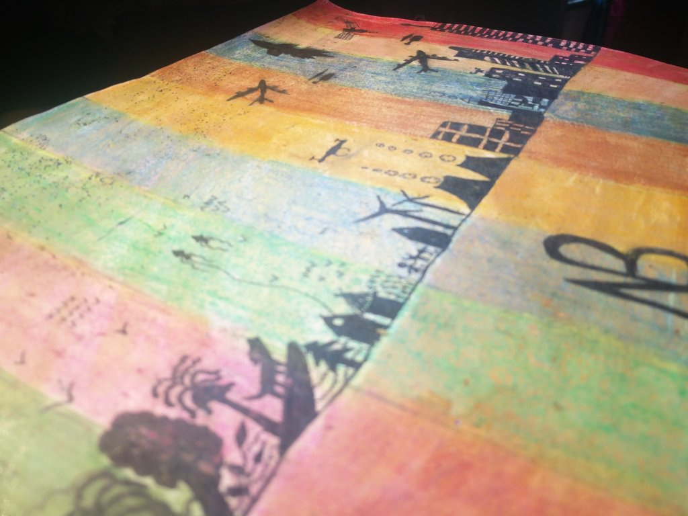

+++
date = '2022-09-12T08:34:46+05:30'
showWordCount = false
title = 'வரலாற்று தேவை; வரலாற்றின் தேவை '
description = ' A Tamizh essay attempting to re-evaluate the significance of history'
summary = ' A Tamizh essay attempting to re-evaluate the significance of history'
+++

## அறிமுகம்

இன்றைய கல்விமுறைகளில், பாடங்களை பயன்பாட்டு நோக்கத்தோடு கற்றுத்தரும்  முறை உருவாக்கிக்கொண்டு இருக்கிறது. ‘Application oriented, ‘Hands-on-learning’ போன்ற சொல்லாடல்களின் பயன்பாடு பெருகி, பாடங்களை கற்கும்போதே அவற்றின் தேவை என்ன?, நடைமுறையில் அவற்றின் பயன்பாடு என்ன? என்பதையும் கற்கும்  அணுகுமுறை உருவாகிவிட்டது. கணிதம், அறிவியல் ஆகியவற்றை நடைமுறை பயன்பாட்டோடும், தேவைகளோடும் பொருத்திப் பார்த்து கற்றுக்கொடுக்கும் முறைகள் பல்கிப் பெருகிவிட்டன. மொழிகளைக்கூட அவற்றின் பயன்பாட்டிற்க்கேற்ப கற்றுத்தரும் பாட திட்டங்கள் பல இன்று உள்ளன. 

ஆனால், வரலாறு எனும் அறிவுத்துறையை இத்தகைய அணுகுமுறைக்கு உட்படுத்தி புரிந்துகொள்ளவோ கற்றுக்கொடுக்கவோ, பெரும்பாலோரால் இயலவில்லை. பள்ளிகளில் அதை நடைமுறையோடும், அன்றாட சூழல்களோடும் பொருத்திப்பார்த்துக் கற்றுத்தரப்படுவதில்லை. இதனால் மாணவர்கள், ‘வரலாறு என்பது நடைமுறையில் தேவையற்ற கருத்து’ என்று கருதும் நிலை உருவாகிவிட்டது. 

அத்தகைய மாணவர்களாகிய நாம் அங்கம்வகிக்கும் இந்த சமூகம், வரலாறு எனும் கருத்தை வாழ்விலிருந்தும், வரலாறு எனும் அறிவுத்துறையை கல்விமுறைகளிலிருந்தும் ஒருவாறு ஒதுக்கிவிட்டது. இதனால் நாம், நம்மைப் பற்றி நமக்கு இருக்க வேண்டிய அடிப்படை புரிதலை இழந்துவிட்டோம். இந்த புரிதலின்மையால், நாம் திக்கற்று ஒரு பயணம் போய்க்கொண்டி இருக்கிறோம். ஏன்? எதற்கு? எதனால்? எப்படி? என்ற கேள்விகளை கேட்கத் தவிர்த்து ஒரு வாழ்க்கையை வாழ்ந்து கொண்டிருக்கிறோம்.

இந்தக் கட்டுரையில், வரலாறு என்றால் என்ன? வரலாறு எனும் கருத்திற்கும் நம் வாழ்விற்கும் உள்ள தொடர்பு என்ன? வரலாறு எனும் கருத்து நம் வாழ்க்கையை எப்படி பாதிக்கிறது? கல்விமுறையில் வரலாறு எனும் அறிவுத்துறையின் முக்கியத்துவம் என்ன? வரலாற்று போக்கினை புரிந்துகொள்ளுதலின் அவசியம் என்ன? ஆகிய வினாக்களுக்கு விடையளிக்க முயன்றிருக்கிறேன்

## வரலாற்று தேவை: வரலாற்றின் தேவை

வரலாற்று போக்கினை புரிந்துகொள்ளுதலின் துவக்கம், வரலாறு என்றால் என்ன? என்ற கேள்விக்கு விடைதேடுதலில் உள்ளது.

சக நிகழ்வுகளின் கோர்வையே வாழ்க்கை; சக நிகழ்வுக் கோர்வைகளின் தொகுப்பே வரலாறு. 

தனிமனித அனுபவங்களின் தொகுப்பே வாழ்க்கை; தனிமனித அனுபவங்களின் கோர்வையே வரலாறு. 

மாற்றங்களின் தொடர்ச்சியே வாழ்க்கை; இத்தொடர்ச்சிகளின் போக்கே வரலாறு.

முக்காலமும் இணையும் அந்தப் புள்ளியே வரலாறு . அதாவது, கடந்தகால நிகழ்வுகளும், அதன் நிகழ்கால தாக்கமும், அந்த தாக்கம் விளைக்கும் எதிர்காலப் போக்கும் இணையும்  அந்தப் புள்ளியே வரலாறு.  

வரலாற்றை கடந்தகாலத்தைப் பற்றிய படிப்பாக மட்டும் அணுகினால், அதை நம்மால் முழுமையாக புரிந்துகொள்ளவே இயலாது. ஏதேனும் ஒரு நிகழ்வைப் பற்றி பேசினால், அதன் தாக்கத்தை பற்றியும், அதனால் விளைந்த மாற்றங்களை பற்றியும் பேசாதிருத்தல், முழுமையான புரிதலை அளிக்காது. 

மாற்றத்தொடர்ச்சியின் போக்கே வரலாறு என்று சொன்னோம். மாற்றம் என்பது ஏதோ ஒரு நிகழ்வும் அதன் தாக்கமும்தான். இவைகளின் தொடர்ச்சியே வரலாறு. அதாவது, இன்று நிகழும் நிகழ்வுகள் யாவும், கடந்தகாலத்தில் நிகழ்ந்த ஏதோ சில நிகழ்வுகளின் தாக்கம்தான்/விளைவுதான். இன்று நிகழும் நிகழ்வுகள் யாவும் எதிர்காலத்தில் நிகழவுள்ள நிகழ்வுகளின் காரணங்கள்தான். இந்த தொடர்ச்சியே வரலாறு. 

அப்படியென்றால், பல கடந்தகால நிகழ்வுகளின் தாக்கம்தான் நம் நிகழ்காலத்தையே தீர்மானித்துக் கொண்டிருக்கிறது. ஆக, வரலாற்று போக்கில்தான் நாம் வாழ்ந்து கொண்டிருக்கிறோம்!

வரலாறு ஏன் கடந்த காலத்தைப் பற்றிய படிப்பு மட்டுமல்ல என்பது உங்களுக்கு இப்பொழுது விளங்கியிருக்கும். அது காலங்களை கடந்து மனிதகுலத்தை புரிந்துகொள்ளும் ஒரு அணுகுமுறை. நாம் எங்கிருந்து வந்தோம்? எதை நோக்கி போகிறோம்? எப்படியெல்லாம் இருந்துவந்திருக்கிறோம்? ஏன் இப்படி இருக்கிறோம்? நாம் யார்? இதுபோன்ற கேள்விகளுக்கு பதிலளிக்கக் கூடிய கருத்து ‘வரலாறு’.

## நாம் எங்கிருந்துவந்தோம்? எதை நோக்கி போகிறோம்?

நாம் எங்கிருந்து வந்தோம்? எதை நோக்கி போகிறோம்? என்கின்ற இவ்விரு கேள்விகள்தான் வரலாற்று போக்கின் பரப்புடனும், விரிவுடனும் நம்மை இணைகின்றன. 

பரப்பு, விரிவு என இரு கருத்துக்கள் வரலாற்று போக்கினை அமைக்கின்றன. இதில் பரப்பை காலத்தால் அளவிடலாம். ஆனால், விரிவினை நம்மால் அளக்க இயலாது. அதன் தாக்கத்தை நம்மால் அநுபவிக்கவும், புரிந்துகொள்ளவும்தான் இயலும்.

தமிழகத்தை ஆண்ட சோழர்களை எடுத்துக்கொண்டால், அவர்களுடைய வரலாற்று போக்கின் பரப்பு சுமார் 1500 ஆண்டுகள். சோழர்களின் வரலாற்று போக்கோ மிகவும் விரிந்து காணப்படுகிறது. அதன் தாக்கங்கள் பலவற்றை நாம் இன்றும் அனுபவித்துக் கொண்டிருக்கிறோம். இன்றைக்கு நடைமுறையில் உள்ள பல நிலப்பதிவு சட்டங்கள் சோழர்கள் அறிமுகப்படுத்தியதே. பதிவிற்கான நில அளவை முறைகளும் சோழர்கள் நடைமுறைப்படுத்தியதே. நாம் இன்று பயன்படுத்தும் ஆவண முறைகள், ஆவண பத்திரங்களை எழுதும் முறைகள், பதிவுப் பத்திரங்களை எழுதும் முறைகள், பயன்பாட்டிற்கேற்ப பத்திரங்களை வடிவமைத்தல், அரசு ஆவணங்களை எழுதுதல் போன்ற பலவற்றை நாம் சோழர்களிடமிருந்துதான் கற்றோம். இவை யாவும் சோழர்களின் வரலாற்று போக்கின் விரிவின் விளைவுகளே..  

இது ஒரு அரச குலத்தின் வரலாற்று போக்கு. இதைப் போல் தனிமனிதர் ஒவ்வொருவருக்கும் இத்தகைய கருத்துக்களால் அமைக்கப்பட்ட தனித்துவமான வரலாற்றுப் போக்கு உண்டு. 

இப்படி ஒரு தனிமனிதனுடைய வரலாற்று போக்கினை எடுத்து ஆராய வேண்டும் என்றால், அதற்கு அடித்தளம் வகுப்பது அந்த மனிதர் யார்? எங்கிருந்து/எதற்காக வந்தார்? எதை நோக்கி போனார்/செயல்பட்டார்? ஆகிய மூன்று கேள்விகள் தான்.

## நாம் எப்படியெல்லாம் இருந்துவந்திருக்கிறோம்?

நாம் இன்று வரலாறு என்று படிக்கும் பெரும்பாலானவை, இந்த கேள்விக்கான விடைகள்தான். நாம் காட்டில் வேடர்களாய் வாழ்ந்த காலம் முதல், நிறுவனங்களை சார்ந்து மாநகரங்களில் குடியேறியிருக்கும் இந்த நாள் வரையில் எப்படி வாழ்ந்தோம்? நம்முடைய வாழ்க்கைமுறை எப்படி இருந்துவந்திருக்கிறது? நாம் ஒரு சமூகமாய் இந்த சூழலோடு நம்மை எப்படி பொருத்திக்கொண்டு வந்திருக்கிறோம்? சமூகத்தின் அமைப்பு எப்படி இருந்திருக்கிறது? மனிதர்களாக நாம் மேற்கொண்ட செயல்பாடுகள் யாவை? ஆக இந்த எல்லா வினாக்களின் விளக்கமும் இணைந்தே, நாம் எப்படி இருந்துவந்திருக்கிறோம் என்று சொல்லும். காலவரிசை (Timeline) என்ற நிகழ்வு வரிசைமுறையே இந்த கேள்விக்கு விடையளிக்கும் நோக்கத்தில் அமைந்துள்ளது.

காலப்போக்கில் ஒரு செயலை நாம் எப்படி செய்து வந்திருக்கிறோம் என்பதை ஆராய்ந்து பார்த்தால், அந்த செயலை நாம் எப்படி நேர்த்தியாகச் செய்யக்கூடும் என்று நமக்கு புரிந்துவிடும். 

தச்சுப்பணி என்று எடுத்துக்கொண்டால், அது காலப்போக்கில் பல்வேறு மாற்றங்களுக்கும், வளர்ச்சிகளுக்கு உட்பட்டு இப்போதைய நிலையை அடைந்திருக்கிறது. ஐம்பது ஆண்டுகள் வரையில் இருந்த தச்சு வேலைக்கும் இப்போதைய தச்சு வேலைக்கும் பெரிய வேறுபாடுகள் உள்ளன. அதுவரையில், குறைந்தது பதினைந்து ஆண்டுகளாவது ஆன மரத்தை வெட்டி, பலகைகள் அடித்து, அவற்றை இழைத்து நேர்த்தியான வடிவம் கொடுத்து, இணைப்புகளை செய்து, கால்களை இழைத்து, அவற்றை ஒன்றாகச் சேர்த்து, வண்ணம் தீட்டினால் அது இறுதியில் மேசை என்ற வடிவத்தை எடுக்கும். இதை எல்லாம் செய்ய பல நாட்கள் ஆகும். ஆனால் இப்பொழுதோ, வெகுசில வகை மரங்களை மட்டுமே வெட்டி, அவற்றை எந்திரங்களில் கொடுத்து தூளாக்கி, அந்த தூள்களை அளவிற்கு ஏற்றார் போல், சுருக்கி, பலகைகளை தயார் செய்து, திருகுகள் (screws) வைத்து இணைத்தால் மேசை உருவாகிவிடும். இதைச் செய்ய மிக சில நாட்களே ஆகும். 

நூறு ஆண்டுகளாயினும், இன்றும் பயன்பாட்டிலுள்ள மேசைகளையும், எழுபது வயது வேப்ப மர  உத்திரங்களையும், நூற்றிஐம்பது ஆண்டுககளான கருங்காலி மர மச்சுக்களையும் நூற்றி ஐம்பது ஆண்டுகளாக பலா மர தூண்களையும், நூறு வயதான அலமாரிகளையும், எண்பது வயதான வேங்கை மரக் கதவுகளையும் நான் பார்த்திருக்கிறேன். ஆனால், நவீன தொழில் நுட்பங்களையும், வடிவமைப்புகளையும் கொண்டு செய்யப்பட்ட  மேசையோ, அலமாரியோ பதினைந்து ஆண்டுகளுக்கு மேல் தாக்குபிடிப்பதில்லை. 

நீங்கள் தச்சுப்பணி செய்யவேண்டும் என்றால், இந்த மாற்றங்களை நன்கு புரிந்து கொண்டால், நேர்த்தியான வடிவமைப்பையும் தொழில்நுட்பத்தையும் உங்களால் எளிதில் தேர்தெடுத்துவிட முடியும்.

அறிவியலிலும் இந்த அணுகுமுறை உண்டு. முறையாக அறிவியல் கற்றுத்தருவோர், நேரடியாக ஒரு கோட்பாட்டை கற்றுத்தர மாட்டார். எதன் அடிப்படையில் அந்த கோட்பாடு முதலில் முன்வைக்கப்பட்டது, இந்த கோட்பாடு எப்படியெல்லாம் வளர்ந்தது, முந்தைய நிலையில் அதில் என்ன குறை இருந்தது, அதை அடுத்த நிலை எப்படி சீர் செய்தது என யாவற்றையும் புரிந்துகொண்ட பின்னரே அந்த கோட்பாட்டை கற்றுத்தருவார்கள். இவற்றையெல்லாம் கற்பதால், அந்த கோட்பாட்டை நாம் அணுகும் முறை ஆழமாகிவிடும். காலப்போக்கில் மனிதர்கள் அந்த கோட்பாட்டை எப்படி அணுகினார்கள்?, இன்று நாம் அதை எப்படி அணுகுகிறோம்? என்பதை நன்கு புரிந்துகொண்டால், அந்த கோட்பாட்டை நாம் அடுத்த நிலையில் ஆழமாக கற்பதற்கு அது ஒரு அடிதளத்தை அமைத்துவவிடும்.

‘வரலாறு வழிநடத்தும்’ என்று சொல்வார்களே, அது இப்படித்தான். நாம் ஒரு செயலை எப்படிச் செய்து வந்திருக்கிறோம் என்று புரிந்துகொண்டால், இன்று அதை நாம் செய்யும் விதத்தில் தானாக ஒரு நேர்த்தி பிறந்துவிடும். இன்றைக்கு நாம் சந்திக்கும் எல்லா சிக்கல்களுக்கும் வரலாற்றை திரும்பிப்பார்த்தால் தீர்வு கிடைத்துவிடும்.

இன்று உலோகங்களின் பயன்பாடு மிகுந்துவிட்டது.  அதற்காக தோண்டப்படும் சுரங்கங்கள் புவிப்பந்திற்கே ஆபத்தை விளைவிக்கும் என்று சொல்கிறார்கள். நாம் பல்லாயிரம் ஆண்டுகளாக உலகங்களை பயன்படுத்தியவர்கள்தான். ஆனால், பல்லாயிரம் ஆண்டுகளுக்கு முன்பு நாம் சுரங்கங்கள் தோண்டியதாக பதிவுகள் இல்லை. பின்பு, எப்படி நாம் உலோகங்களை பயன்படுத்தினோம் என்று கேட்டிருந்தால் இந்த சிக்கலை தவிர்த்திருக்கலாம். 

நம்முடைய கட்டுமானங்களுக்காக பல மலைகளை குடைந்து எடுத்துக் கொண்டிருக்கிறோம். அந்த தொழில்நுட்பமும் ஆபத்தானது என்று சொல்லுகிறார்கள். நாம் பல்லாயிரம் ஆண்டுகளாக கோயில்களைக் கட்டியுள்ளோம், அரண்மனைகளைக் கட்டியுள்ளோம், கோட்டைகள் கட்டியுள்ளோம். அப்பொழுதெல்லாம் நாம் மலைகளை குடைந்தோமா? ‘Quarrying’ என்ற தொழில்நுட்பம்தான் அப்பொழுது இருந்ததா?   

இவை வெறும் சில எடுத்துக்காட்டுகள் தான். இது போல், நாம் இன்று சந்திக்கும் பல சிக்கல்களுக்கும், நெருக்கடிகளுக்கும் வரலாறு தன்னகத்தே தீர்வுகளைக் கொண்டுள்ளது.

## நாம் ஏன் இப்படி இருக்கிறோம்? 

நாம் எல்லோரும் நம் ஆரம்பப்பள்ளியில் இந்த பயிற்சியினை செய்திருப்போம். ஒரு வட்டம், ஒரு சதுரம், இரு வட்டங்கள், இரு சதுரங்கள், மூன்று வட்டங்கள். அடுத்து என்ன வரும்? என்று கேட்டால், அந்த வரிசை முறையை கவனித்துவிட்டு, நாம் மூன்று சதுரங்கள் என்று எழுதுவோம். அது எதுவாக வேண்டுமானாலும் இருக்கலாம் அல்லவா? ஏன் மூன்று சதுரங்கள்தான் வர வேண்டும்? என்று கேட்டால். அதற்கு “முன்னே இருக்கின்ற வரிசையை பாருங்கள். அது ஒன்று, இரண்டு, மூன்று என்று அதிகமாகிறது. ஆகையினால் இங்கு மூன்று சதுரங்கள்தான் வரவேண்டும்” என்று எளிதாக நிறுவிவிடலாம். 

அதைப்போல, நம்மை சுற்றி உள்ள சூழலும் திடீரெனெ, இப்போதைய நிலையை அடைந்துவிடவில்லை. கடந்த கால நிகழ்வுகள் பலவற்றின் வரிசைமுறையின் தாக்கமும், விளைவுகளும்தான் நம்முடைய தற்போதைய சூழலையும், நம்மையும் வடிவமைத்திருக்கிறது. முன்னமே குறிப்பிட்டது போல், பல கடந்தகால நிகழ்வுகளின் தாக்கங்களும் விளைவுகளும்தான் நம் நிகழ்காலத்தை தீர்மானித்துக் கொண்டிருக்கின்றன. நாம் உண்ணும் உணவு, உடுத்தும் உடை, பருகும் பானங்கள், கட்டிக்கொள்ளும் வீடுகள், படிக்கும் படிப்பு, பயன்படுத்தும் பொருட்கள், செய்யும் தொழில் என யாவும் கடந்தகால நிகழ்வுகளின் தாக்கங்கள்தான். 

நாம் எப்படியெல்லாம் இருந்துவந்திருக்கிறோம்? என்ற கேள்வியும், நாம் ஏன் இப்படி இருக்கிறோம்? என்ற கேள்வியும் ஒன்றோடு ஒன்று நெருக்கமான தொடர்பு உடையது. ஆனால், இவை இரண்டின் விடைகளும் ஒன்றல்ல. வரலாற்று போக்கின் தொடர் நிகழ்வு வரிசையே முதல் கேள்விக்கான பதில். இந்த வரலாற்று போக்கில், எந்தெந்த தொடர் நிகழ்வுகளெல்லாம் என் நிகழ்காலத்தை வடிவமைத்திருக்கிறது என்பது இரண்டாவது கேள்வியின் பதில்.

இவ்விரு கேள்விகளின் பதில்கள்தான், நம் அன்றாட வாழ்வை வடிவமைக்கும் வரலாறு எனும் கருத்து. நாம் செய்யும் எல்லா செயல்பாடுகளிலும் இந்த கருத்தின் பாதிப்பு இருக்கும். அந்த கருத்தை நிராகரித்துக்கொண்டு வாழ்க்கையை நகர்த்தினால், சூழல்களையும், அதில் நிகழும் மாற்றங்களையும் நம்மால் ஆழமாக புரிந்துகொள்ளவே இயலாது.

நம்மில் பலர், நிறுவனங்களைச் சார்ந்தும், அவர்கள் தரும் ஊதியத்தின் பின்னாலும் அமைந்த ஒரு வாழ்க்கைமுறையில் வாழ்கிறோம், அல்லது வாழத் துடிக்கிறோம். பலர் அத்தகைய வாழ்க்கைமுறையைத் தாண்டி சிந்திக்கும் திறனை இழந்துவிட்டனர். பயன்படுத்தும் பொருட்கள் அனைத்தும் நிறுவனங்கள் கொடுப்பதுதான், அவற்றை வாங்கும் பணமும் நிறுவனங்கள் வழங்குவதுதான். இப்படியா நாம்  வாழ்ந்தோம்? இது சரியான வாழ்க்கைமுறைதானா?  எந்தெந்த குறைகளால் இந்த வாழ்க்கைமுறை நமக்கு அறிமுகம் செய்யப்பட்டதோ, அவையெல்லாம் இன்று தீர்ந்துவிட்டதா? இல்லை இந்த வாழ்க்கையில்தான் குறைகளே இல்லையா?

இந்த வாழ்க்கைமுறையில் ஏராளமான சிக்கல்கள் உள்ளன. புவி சூழலை முற்றிலுமாக மாசுபடுத்திவிட்டோம். நம்முடைய உடல் நலத்தை இழந்துவிட்டோம். சீர்குலைந்த வாழக்கைமுறைக்குள் தள்ளப்பட்டு விட்டோம். நிம்மதியான வாழ்க்கையை இழந்துவிட்டோம். முக்கியமாக, தரமான உணவையும், நீரையும், காற்றையும் நாம் இழந்துவிட்டோம். இந்த வாழ்க்கைமுறை எனக்கு ஒத்துப்போகவில்லை என்று சொல்பர்கள் ஏன் வரலாற்றை திரும்பிப்பார்க்கக்கூடாது? ஏன் நாம் இந்த நிறுவனங்களை சார்ந்த வாழ்க்கைமுறைக்குள் வந்தோம் என்ற கேள்வியை கேட்டால், அதை கடந்து அப்படி ஒரு வாழ்க்கைமுறையை நமக்கு அது மீண்டும்அறிமுகப்படுத்தும். 

வரலாற்று போக்கினை நாம் நன்கு புரிந்து கொண்டால் அது நம்மை ஒருபோதும் வழிநடத்தத் தவறாது. நாம் செய்யும் செயல்களில் நேர்த்தியையும், சிந்தித்து அணுகும் முறைகளில் தெளிவையும் அது பிறக்கச் செய்துவிடும்.

## நாம் யார்? நான் யார்?

நான் ஒரு மனிதன். நாம் மனிதர்கள். ஒத்த பண்புகளை உடைய ஒரு உயிரினக்கூட்டம். பலகாலமாக, இந்த புவிப்பந்தின்மேல் கூடி வாழ்ந்த ஒரு உயிரினம் நாம். வரலாற்று போக்கினை புரிந்துகொள்ளுதற்கு இந்த மனநிலை அவசியம். நம்மை ஒரு மனிதனாக மட்டும் உணர்ந்து வரலாற்றுப் போக்கினை அணுகும்பொழுது, அதன் மெய்மை நமக்கு விளங்கும்.

ஏதேனும் ஒரு அடையாளத்தோடு, நாம் வரலாற்றுப் போக்கினை புரிந்துகொள்ள முற்பட்டால், அது நம் கண்களில் ஒரு திரையை போர்த்திக்கொண்டு பார்ப்பது போன்றது. அதன் நிழலில்தான் நாம் நிகழ்வுகளைக் காண்போம். 

மனிதன் என்ற அடையாளத்தோடு மட்டும் வரலாற்றுப்போக்கினை புரிந்துகொள்ள முற்படுங்கள். அந்த அடையாளமும், காலப்போக்கில் மறைந்துவிடும். இந்த மனிதகுலம் இந்தப் புவிப் பந்தின்மேல் எப்படி வாழ்ந்துவந்திருக்கிறது என்பதை வேடிக்கை பார்க்கும் ஒருவராக மாறிவிடுவீர்கள். எவ்வித அடையாளங்களும் இன்றி, கண்ணில் எவ்வித திரையும் இன்றி இந்த வரலாற்று போக்கினை புரிந்துக் கொள்ள துவங்கிவிடுவீர்கள்.

வரலாற்று போக்கின் நுணுக்கமான, சீரான தொடர்ச்சியை புரிந்துகொள்ளத் துவங்கினால், அந்தத் தொடர்ச்சியில் “நாம் யார்? நான் யார்?” என்ற கேள்வியைத்தான் அது கேட்கத் தூண்டும். ஆக, வரலாற்று போக்கின் ஆழமான புரிதல் நம்மை மீண்டும் தன்னுணர்தலை நோக்கித்தான் தள்ளும். அடையாளங்கள் அற்ற மனிதராய் தன்னை உணர்ந்தால்தான், வரலாற்று போக்கின் மெய்மை விளங்கும். வரலாற்று போக்கின் மெய்மை விளங்கத் துவங்கினால் அது மீண்டும் நம்மை தன்னுணர்தலை நோக்கியே தள்ளும். அப்படியென்றால், வரலாற்று போக்கின் துவக்கமும், இறுதியும் நான் யார்? எனும் தன்னுணர்தல் தான்.

## முடிவுரை

வரலாறு என்பது நம் ஒவ்வொருவருடைய அன்றாட வாழ்வையும் வடிவமைக்கும் ஒரு கருத்து. அதன் போக்கினை ஆழமாக புரிந்துகொள்ளுதல் அவசியம். அது நம் சூழலையும், அதில் நிகழும் மாற்றங்களையும் புரிந்துகொள்ளுதலை எளிதாக்கிவிடும். செயல்களின் பின்னால் உள்ள காரணங்கள் விளங்கிவிடும். மாறும் சூழல்களோடு பொருந்திக்கொள்ளும் தன்மை நமக்கு வந்துவிடும். நாம் போகும் பாதை சரியானதா? என்று கேட்டு நம் வாழ்வினை சீர்செய்துகொண்டே இருக்கும் மனப்பக்குவம் நமக்கு வாய்த்துவிடும். ஏன்? எதற்கு? எதனால்? எப்படி? என்றெல்லாம் கேட்டு வாழத் துவங்கிவிடுவோம். இறுதியாக, நான் யார்? என்கின்ற தன்னுணர்தலை நோக்கி அது நம்மை நகர்த்தும்.
