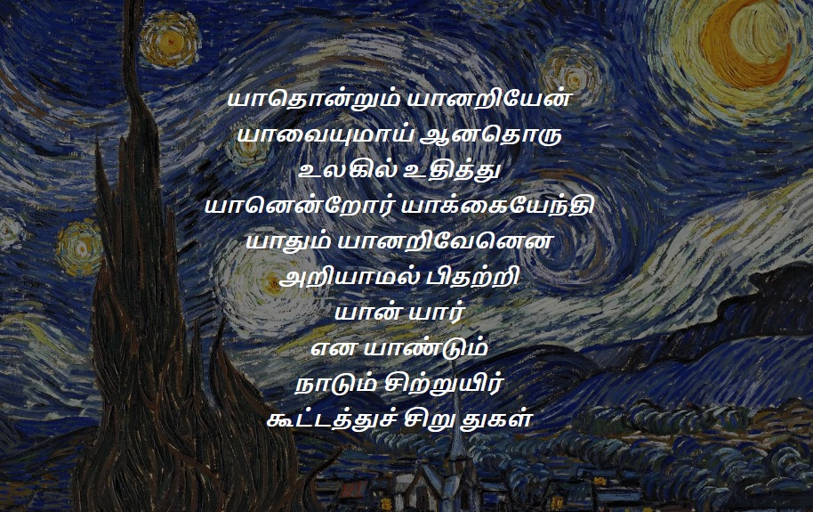

+++
date = '2023-06-30T08:34:46+05:30'
showWordCount = false
showTableOfContents = true
title = 'வேறுபாடும் தன்னுணர்வும் '
summary = 'On differentiation and self-realization (a tamizh essay)' 
+++

## அறிமுகம்

பொருட்கள் யாவும் ஓர் மூலத்திலிருந்துதான் (source) வெளிப்பட்டன என்பது மனிதர்கள் யாவரும் ஒப்புக்கொள்ளும் கருத்து. “அந்த மூலம் யாது?” என்பதில்தான் மாற்றுக் கருத்துக்களே அன்றி, அப்படி ஒரு மூலமே இல்லை என்பதாக உரைக்கும் கருத்து உள்ளதா? என்று தெரியவில்லை.



“யாவற்றையும் ஆக்கும் மூலம் ஆற்றலா? இல்லை அதையும் படைத்ததாகச் சொல்லப்படும் இறைமையா?” என்பதாகத்தான் இரு கருத்துக்கள் உள்ளன. “அப்படி, ஓர் மூலமே இல்லை” என்று உரைக்கும் கருத்து உள்ளதா என்று எனக்குத் தெரியவில்லை. ஒரு வேளை உள்ளது என்றால், எனக்குத் தெரியப்படுத்துங்கள். அதைப்பற்றி தெரிந்துக் கொள்ளவும் ஆர்வமாக உள்ளேன்.



கடந்த சில நூறு ஆண்டுகளாக மனித குலத்தில் மிகவும் தீவிரமாக நிகழும் விவாதம் இது. பேரண்டங்களை, அதன் அங்கங்களை, கோள்களை, அதில் வாழும் உயிரினங்களை ஆக்கும் மூலம் பேராற்றலா? பரம்பொருளா? என்பதே அவ்வாதம். இவ்விரு கருத்தாருக்கும் இடையிலான வாதம் பல தளங்களிலும் நிலைகளிலும் நிகழ்ந்துள்ளன.

ஆன்மிகத்திற்கும் அறிவியலுக்கும் இடையில், பகுத்தறிவுக்கும் பழக்கங்களுக்கும் இடையில், ஆத்திகத்திற்கும் நாத்திகத்திற்கும் இடையில், மதத்தினருக்கும் மற்றவர்களுக்கும் இடையில், என இந்த வாதம் பல தளங்களிலும் நிலைகளிலும் நிகழ்ந்துள்ளன.



இருதரப்பிலும் சிறந்த பேச்சாளர்கள், எழுத்தாளர்கள், சிந்தனையாளர்களும் தோன்றி மறைந்துள்ளனர். மேலோட்டமான கருத்துக்களில் துவங்கி ஆழமான கோட்பாடுகள் வரையில் இரு தரப்பினரும் முன்வைத்திருக்கிறார்கள். இந்த வாதத்தில் நாம் அணிவகுக்க வேண்டுமெனில் இரு தரப்பு விவாதங்களைப் பற்றியும் ஆழமான புரிதல் அவசியம். எனக்கு இருதரப்பு வாதங்களைப் பற்றிய அறிவு மிகக் குறைவு. ஆகையால் நான் இந்த வாதத்திற்குள் செல்லப் போவதில்லை.



இந்த வாதத்தைப் பற்றி இங்கு பேசுவதற்கான காரணம், இரு பிரிவினரும் ஒப்புக்கொள்ளும் ஒரு கருத்தை பற்றியது. யாவையும் வெளிப்பட்டது ஓர் மூலத்திடமிருந்து தான். ஆகையினால், நமக்கும், நம்மைச் சுற்றியுள்ள பொருட்களுக்கும் எவ்வளவுதான் வேறுபாடுகள் இருந்தாலும், நாம் இந்த நிலையில், இந்த கருத்தின் அடிப்படையில், யாவற்றோடும் ஒற்றுமை உடையவர்களே.

யாவரும், யாவையும், ஓர் மூலத்திலிருந்து தான் வெளிப்பட்டது என்ற தெளிவோடு மற்ற ஒரு கேள்வி பிறக்கிறது. “பேராற்றலோ, பரம்பொருளோ, எப்படி இவ்வளவு பேரண்டங்களாக விரிந்துள்ளன? இத்தனை வேறுபாடுகளை உடைய கட்டமைப்புகளை எப்படி அது உருவாக்கியது?” என்பதே அக்கேள்வி.

யாவற்றையும் வெளிப்படுத்திய அந்த மூலம் எதுவாய் இருப்பினும், அது படைக்கிறதா? பரிணமிக்கிறதா?

இதுவும் மனிதர்களுக்கிடையே பல காலமாக வாதிக்கப்பட்டு வரும் கருத்துதான். அறிவியலும், மெய்யியலும் பல காலமாக விடை தேடிக் கொண்டிருக்கும் கேள்வி இது. இந்த வாதத்திற்குள்ளும் நாம் செல்லப் போவதில்லை. மாறாக, இந்த வாதத்தின் இரு பிரிவினரும் ஒப்புக் கொள்ளும் கருத்தையே நாம் ஆராயப் போகிறோம்.



“எல்லா பொருட்களும் வேறுபாடுகளையும் தனித்தன்மைகளையும் பெற்று, அவற்றை இழக்கும் போக்கில் அமைந்துள்ளன” என்பதே அக்கருத்து. வேறுபாடு (difference) என்பது, “இது வேறு அது வேறு” என்ற நிலை.

ஒரு தாயின் வயிற்றில் வளரும் கரு இதற்குத் தக்க சான்று. கருப்பையில் வளர்ச்சி அடையும் காலத்தில், தாயின் உடலும், பிள்ளையின் உடலும் ஒன்றியே உள்ளன. “இது வேறு, அது வேறு” என்ற நிலை அங்கு இல்லை. கருப்பையைவிட்டு வெளியேறி சில காலம் கழித்துதான், “தன் உடல் வேறு, தன் தாயின் உடல் வேறு” என்று அந்த கரு உணருகிறது.

தனித்தன்மை (uniqueness) என்பது அந்த பொருளுக்கே உரித்தான இயல்புகளும் குணங்களும்.



ஆக்கத்தின் ஒவ்வொரு நிலையிலும் புதிய வேறுபாடுகளும் (differences), தனித்தன்மைகளும் (uniqueness) வெளிப்படுகின்றன. இந்த வேறுபாடுகளும், தனித்தன்மைகளும் ஒரு நிலையில் நிறைவு பெறுகின்றன. இன்னும் சொல்லப்போனால், புதிதாய் வெளிப்பட்ட வேறுபாடும், தனித்தன்மையும், அந்த நிலையில் நிறைவு பெற்றால்தான் அவை ஆக்கத்தின் அடுத்த நிலையையே அடையும். இவ்வாறு, ஆக்கத்தின் ஒவ்வொரு நிலையிலும் புதிய வேறுபாடுகளும், தனித்தன்மைகளும் வெளிப்படுகின்றன, நிறைவடைகின்றன, புதிய வேறுபாடுகளையும், தனித்தன்மைகளையும் வெளிப்படுத்துகின்றன. இந்தத் தொடர்ச்சியே பேரண்டங்களின் பன்முகத் தன்மையை (diversity) ஆக்குகின்றன.

நவீன அணுக்கொள்கையில் கூறப்படும் “Valence” மற்றும் “Bonding” என்ற இரு கருத்துக்களே இதற்கு தக்க சான்று. Valence என்பது ஒரு அணுவின் நிறைவற்ற தன்மையை குறிப்பதாகும். இந்த நிறைவற்ற நிலையிலேயே அணுவால் நிலைக்க இயலாது. இந்த நிறைவற்ற நிலையில் அணு நிலைத்துவிட்டால், அடுத்தக்கட்ட ஆக்கம் நடைபெறாது. ஆகையினால், அந்த அணு மற்றொரு அணுவுடன் சேர்கிறது. அது எவ்வாறு சேர்கிறது என்பதே bonding என்ற கறுத்து.



H2O என்று சொல்லப்படும் நீர் ஆக்கப்படுவதுகூட இவ்வாறுதான். Hydrogen அணுக்களும் Oxygen அணுவும் தம் நிறைவற்ற தன்மையை போக்கிக்கொள்ள ஒன்றோடு ஒன்று சேர்கின்றன. இந்த சேர்க்கையே நீரின் மூலக்கூறினை (molecule) ஆக்குகிறது. ஆக, ஒரு பொருள் அணு நிலையில் நிறைவு பெற்றால்தான் அடுத்தக்கட்ட ஆக்கம் நிகழும்.

இவ்வாறு அணு நிலையில் நிறைவு பெரும் பொருள், ஆக்கத்தின் அடுத்த நிலையை அடைகிறது. பல்வேறு படிநிலைகளில் ஆக்கப்பட்டு ஒரு பெரும் கட்டமைப்பு வெளிப்படுகிறது. நாம் வாழும், இந்த புவிப்பந்துகூட அவ்வாறான கட்டமைப்புதான். பொதுவாக, ஆக்கத்தின் படிநிலைகளில், முந்தய நிலையைக் காட்டிலும் அடுத்தடுத்த நிலைகளில் வேறுபாடுகளும் தனித்தன்மைகளும் கூடுதலாக வெளிப்படும். ஒருவேளை, ஒரு கட்டமைப்பின் அடுத்தடுத்த படிநிலைகளில் வேறுபாடுகளும், தனித்தன்மைகளை குறைந்தால், அது அதன் அழிவின் படிநிலை.



ஒரு சுவரே அழிவின் படிநிலையை விளக்க பொருத்தமான சான்று. ஒரு சுவரைக் கட்டியெழுப்ப செங்கல், மணல், சிமெண்ட் (cement), நீர், ஜல்லிக்கற்கள் போன்ற பொருட்கள் தேவை. இவை யாவும் ஆக்கத்தின் படிநிலைகளில் எதோ ஒரு நிலையில் நிறைவு பெற்றவைதான். ஒரு கொத்தனாரோ, தனது தொழில்நுட்பங்களைக் கொண்டு இந்த பொருட்களையெல்லாம் சேர்த்து ஒரு சுவரை எழுப்புகிறார்.

சுவரை எழுப்பும் செயல்முறையில், இந்த பொருட்கள் யாவும் தத்தம் வேறுபாடுகளையும், தனித்தன்மைகளையும் இழக்கின்றன. ஒரு சுவரில், செங்கல் வேறு, மணல் வேறு, சிமெண்ட் வேறு என்ற நிலை இல்லை. அவை யாவையும் ஓர்ந்தே சுவர் எனும் கட்டமைப்பை ஆக்குகின்றன. அதேபோல, ஒரு சுவரில் செங்கல்லின் இயல்புகளும், மணலின் குணங்களும் தனித்தனியே செயலாற்றுவதில்லை. அவை யாவையும் சேர்ந்து சுவரின் இயல்புகளாகவும், குணங்களாகவும் செயலாற்றுகின்றன.

ஒருவேளை, சுவர் கட்டப்பட்ட பின்னரும் அதன் மூலப்பொருட்கள் தனித்தனியே செயலாற்றினால், கொத்தனார் சரியில்லை! ஆளை மாற்றவேண்டியதுதான்! சுவரையும்தான்!



சுவர் என்பது ஒரு நிறைவான கட்டமைப்பு. அதன் அடுத்தடுத்த படிநிலைகளில், வேறுபாடுகளும் தனித்தன்மைகளும் குறையும். அந்த சுவரை தனித்தனியாக பிரித்தால்கூட அதன் மூலப்பொருட்களெல்லாம் தத்தம் தனித்தன்மைகளையும் வேறுபாடுகளையும் இழந்தே காணப்படும். இது அதன் அழிவின் படிநிலை.

ஆக, படைக்கப்பட்ட எல்லா பொருட்களும், வேறுபாடுகளையும், தனித்தன்மையையும் பெற்று அவற்றை இழக்கும் போக்கில் உள்ளன. இது ஒரு பெரும் சுழற்சி (cycle). நாம் காணும் பொருட்கள் யாவும் இந்த சுழற்சியில் எதோ ஒரு நிலையில் இருப்பவைதான்.



## உயிருள்ளவை X உயிரற்றவை

வாழ்பவை யாவும் உயிருள்ளவை; வாழாதவை யாவும் உயிரற்றவை. அப்படியென்றால், வாழ்வது என்பது என்ன? பிறப்பதற்கும், இறப்பதற்கு இடையில் தம் தேவைகளை தாமே நிறைவேற்றிக்கொண்டு, பிற செயல்பாடுகளை செய்வதே வாழ்க்கை.



ஒரு விண்மீனை எடுத்துக்கொள்வோம். அது பிறக்கிறது, தன் தேவைகளை தானே நிறைவேற்றிக்கொண்டு, பிற செயல்பாடுகளையும் செய்துக்கொண்டு, ஒரு கட்டத்தில் வெடித்து சிதறி அழிந்து போகிறது. அப்படியென்றால் அவை உயிருள்ளவையா? உயிருள்ள பொருட்களின் பட்டியலில் நாம் விண்மீன்களை சேர்கிறோமா? இல்லை!

வாழ்பவை யாவும் உயிருள்ளவை என்பது ஒரு மேலோட்டமான புரிதல். “ஆக்கப்படுவன யாவும் அழிந்துபோகும்” என்பது படைப்பின் விதி. அழியாத பொருள் என்று ஏதுமில்லை. ஆக்கத்திற்கும் அழிவிற்கும் இடைப்பட்ட காலத்தில் எல்லா பொருட்களும் எதோ சில செயல்பாடுகளைச் செய்கின்றன. நம்முடைய கணக்கின்படி இதுதான் வாழ்க்கை எனில், எல்லா பொருட்களும் உயிருள்ளவைதான்!

உயிர் எனும் பொருள் ஒரு வடிவத்திற்கு (உடலுக்கு) சில பண்புகளை அளித்து, அது ஒருசேர இயங்கும் பாங்கை வழங்குகிறது. இந்தப் பண்புகளே உயிருள்ளவை, உயிரற்றவை என்ற பாகுபாட்டை அளிக்கிறது.

## மாயை, ஆணவம், கன்மம் 

“உயிர் எனும் பொருள் ஒரு உடலுக்கு சில பண்புகளை அளிக்கிறது” என்று குறிப்பிட்டோம். மாயை, ஆணவம், கன்மம் அதில் மூன்று முக்கிய பண்புகள்.

1. மாயை ( நிலையற்ற காரணிகளை உணர்தல்)
2. ஆணவம் ( நான் என்ற உணர்வு/ தன்னுணர்வு)
3. கன்மம் ( நான் என்று உணர்ந்தவற்றை தக்கவைக்கும் முயற்சிகள்).

இவை மூன்றும் உயிருள்ளவை, உயிரற்றவை, என்ற பாகுபாட்டை வழங்குகின்றன. உலகெங்கும் உள்ள பல மெய்யியல் மரபுகளிலும் இந்த பண்புகளைப் பற்றி பல்வேறு தகவல்களும் கருத்துக்களும் பதிவு செய்யப்பட்டுள்ளன. தமிழர் மரபில் இந்த பண்புகள் “மும்மலங்கள்” என்ற தலைப்பின் கீழ் வழங்கப்பெற்றுள்ளன. ஒரு தனி மனிதனுடைய வாழ்க்கை போக்கு இம்மூன்று பண்புகளையும் களையும் பாதையில் அமைக்கப்பட்டுள்ளது. ஆகையினாலே அவற்றை “மும்மலங்கள்” என்று வழங்கி இருக்கலாம்.

## மாயை



அணுவை ஆங்கிலத்தில் “atom” என்று அழைப்பார்கள். “Atom” எனும் கிரேக்க சொல்லுக்கு “indivisible” அல்லது “பிரிக்கவியலாத” என்று பொருள். இந்த சொல்லை முதன்முதலாக பயன்படுத்தியதாகச் சொல்லப்படும் மனிதர் டெமோகிரிட்ஸ் (Democritus) எனும் கிரேக்க சிந்தனையாளர். அவர் அணுவை ஒரு எளிய சான்றைக்கொண்டு நிறுவுகிறார்.



“ஏதேனும் ஒரு பொருளை எடுத்து, அதை உடைத்துக் கொண்டே சென்றால் இறுதியில் நம்மிடம் மிஞ்சுவது அணுக்கள் மட்டுமே” என்பதே அவரின் சான்று. அணுவின் நிலையை அடைந்த பின்பு, அந்த பொருளை மேலும் உடைக்கவியலாது. ஆகையினாலேயே அணுவிற்கு “பிரிக்கவியலாத” என்ற பொருளில் அமைந்துள்ள சொல்லைப் பயன்படுத்தியுள்ளார்.

இது ஒரு எளிமையான சான்று! ஆயினும், இது பல நிலைகளில் உள்ள அறிவு சார்ந்த கேள்விகளுக்கு விடை அளிக்கிறது. ஒரு பொருளை உடைப்பது என்றால், வெறுமனே கையால் இரண்டு துண்டுகளாக ஆக்குவது மட்டுமல்ல. அந்தப் பொருள் எவ்வாறு திகழ்கிறதொ, அந்த நிலைக்கு அது ஆக்கம் பெற்ற பல்வேறு படிநிலைகளை களைதலும் உடைத்தல் என்ற செயலின் கீழ் அடங்கும்.

ஆக்கத்தின் படிநிலை என்பது புதியதொரு வேறுபாடோ, தனித்தன்மையோ, பிறக்கும் நிலை. பொருட்களின் ஆக்கத்தில் பிறக்கும் வேறுபாடுகளும், தனித்தன்மைகளும்தான் இந்தப் பேரண்டத்தின் பன்முகத்தன்மையை ஆக்குகின்றன. இந்த வேறுபாடுகளையும், தனித்தன்மைகளையும் ஒவ்வொன்றாக களைந்துக்கொண்டே வந்தால் இறுதியில் எஞ்சுவது அணுவின் நிலை.



அறிமுகத்தில் எடுத்துக்கொண்ட சுவரின் சான்றையே மீண்டும் எடுத்து ஆராயலாம். ஒரு சுவரை உடைத்தால், நமக்கு செங்கல்லும், மணலும், சிமெண்டும் கிடைக்கும். மணலை மேலும் உடைத்தால், பலவிதமான பாறை வகைகளின் நுண்துகள்கள் கிடைக்கும். அவற்றை மேலும் உடைத்தால், அந்தப் பாறையை ஆக்கும் மூலக்கூறுகள் கிடைக்கும். இப்படி ஒரு பொருளை உடைத்துக்கொண்டு சென்றால், இறுதியில் எஞ்சுவது அணுவின் நிலை.

அணுவின் நிலையில் வேறுபாடுகளும், தனித்தன்மைகளும் மிகக் குறைவு. “இதுவே “இறை”க்கு நெருக்கமான நிலை” என்கிறார் டெமோகிரிட்ஸ். “அணு நிலையில் உள்ள வேறுபாடுகளையும், தனித்தன்மைகளையும் மேலும் களைந்துகொண்டே சென்றால், இறுதியில் எஞ்சுவது இறை நிலையே” என்கிறார் மாணிக்கவாசகர்.

> அணுத்தருந் தன்மையில் ஐயோன் காண்க 
> இணைப்பரும் பெருமையில் ஈசன் காண்க 
> அரியதில் அரிய அரியோன் காண்க 
> மருவியெப் பொருளும் வளர்ப்போன் காண்க 
> நூலுணர் வுணரா நுண்ணியோன் காண்க 
>
>&emsp;&emsp;&emsp;&emsp;&emsp;&emsp;&emsp;&emsp;&emsp;&emsp;திருவாசகம் 
>&emsp;&emsp;&emsp;&emsp;&emsp;&emsp;&emsp;&emsp;&emsp;&emsp;திருவண்டப்பகுதி (7) 



நவீன அறிவியலின் புதிய கண்டுபிடிப்புகளால், இன்று நாம் அணு நிலையையும் களைந்துவிட்டோம். அணுவினும் நுண்ணிய நிலையில் உள்ள பொருட்களை (sub-atomic particles) நிறுவிவிட்டோம். Electron (எதிர்), Proton (நேர்), Neutron (நிலை) என்று அந்த பொருட்களை அவற்றின் ஆற்றல்களின் அடிப்படையில் பாகுபடுத்தி இருக்கிறோம். இன்னும் சொல்லப்போனால், இந்த நுண்ணிய பொருட்களை ஆக்கும் மற்றொரு பொருளான “quarks” என்பதையும் நிறுவியுள்ளோம்.



“Quarks”ன் குணங்களை அறிந்து அவற்றையும் வகைப்படுத்தி, அதனினும் நுண்ணிய பொருளை கண்டறிவதே நவீன அணுவியலின் தற்போதயைத் தேடல். “அணுவிலும் நுண்ணிய நிலையில் இறைவனே உள்ளான்” என்று மாணிக்கவாசகர் சொன்னதாலோ என்னவோ, “quarks”னும் நுண்ணிய பொருளுக்கு “god particle” என்று பெயரிட்டிருக்கிறது, நவீன அறிவியல். “God particle” என்பது யாது?, அது எவ்வாறு இருக்கக்கூடும்? அதன் இயல்புகள் என்னவாக இருக்கும்? என்ற இவ்வாறான கேள்விகளுக்கு விடையளிக்கும் நோக்கத்தில் பல ஆய்வுக்கட்டுரைகள் வெளிவந்துள்ளன. அவை யாவும் யூகங்களே. அறிவியல்ரீதியாக இன்னும் “god particle” எனும் நுண்பொருள் நிறுவப்படவில்லை.

இந்த நிலையில் இருந்து பிறக்கும் அனைத்து வேறுபாடுகளும், தனித்தன்மைகளும் மாயைகள். அவை ஒரு குறிப்பிட்ட இலக்கை நோக்கி பயணிக்கும் நிலையற்ற காரணிகள். அந்த இலக்கை அடைந்தவுடன், வெளிப்பட்ட ஆக்க நிலையை நோக்கி அவை திரும்புகின்றன. இந்த சுழற்சியைப் பற்றி நாம் அறிமுகத்திலேயே கண்டோம்.



இந்த மாயை தான் பேரண்டத்தையே ஆக்குகின்றன. அதன் விளைவுகள் தான் யாவும். அத்தகைய மாயையினால் வெளிப்பட்ட பல்லாயிரம் கோடி துகள்களில் மனிதர்களாகிய நாமும் அடக்கம். ஒரு குறிப்பிட்ட இலக்கை நோக்கி நகரும் எல்லா பொருட்களில் நாமும் ஒன்று. அந்த குறிப்பிட்ட இலக்கை அடைந்தவுடன் நாமும் அழிந்துப்போவோம். ஆக, நாமும் மாயையே! தற்காலிகத்தில் திழைக்கும் துகள்கள் நாம்!

ஆக்கப்படும் எல்லா பொருட்களும் மாயைதானே. அப்படியென்றால், உயிரினங்களின் பண்புகளைப்பற்றி பேசும்பொழுது ஏன் மாயைப்பற்றிக் குறிப்பிடுகிறோம்?

இந்த கேள்விக்கு விடைகாண வேண்டுமெனில், மாயையை இரு தளங்களிலிருந்து நாம் அணுகவேண்டும்.

1. மாயை எனும் கருத்து (idea)
2. மாயை எனும் பண்பு (tendency)

மாயை எனும் கருத்து (idea) ஆக்கத்தின் காரணி (factor). படிநிலைகளாக வேறுபாடுகளையும், தனித்தன்மையையும் வழங்கி, இந்த பேரண்டங்களின் பண்முகத்தன்மையை (diversity) ஆக்குவது மாயை எனும் கருத்து. அந்த கருத்தின் விளைவுகள்தான் யாவும். அந்த கருத்தின் விளைவுகள் தான் நாமும்.



மாயை எனும் பண்பு (tendency) உயிருள்ளவற்றுக்கே உரித்தானது. உயிருள்ளவற்றுக்கு, நிலையற்ற காரணிகளுள், தற்காலிக நிலைத்தன்மையை வழங்குவது மாயை எனும் பண்பு. இந்த தற்காலிக நிலைத்தன்மையைத்தான் நாம் வாழ்க்கை என்று புரிந்துகொள்கிறோம். மாயை எனும் பண்பிற்கு ஆட்பட்டே, உயிரினங்கள் தத்தம் தன்னுணர்தலிகளைப் பெறுகின்றன.

ஆக, உயிருள்ளவை மாயை எனும் பண்பிற்கு ஆட்படும், மாயை எனும் கருத்தின் விளைவுகள்.

## ஆணவம்

இருமைகளில் (duality) பிறப்பது “நான்” என்ற கருத்து. ஒரு பொருள், இரு தனிப் பொருட்களாக வேறுபட்டு, தனித்துவமான அடையாளங்களைப் பெற்று திகழ்வதே “நான்” என்ற கருத்து பிறக்கும் படிநிலை. “நான்” என்று சொல்லும்பொழுதே, நான் அல்லாததும் இங்கு உண்டு என்று பொருள். எல்லாம் ஒரே பொருள்தான் என்றால், அங்கு “நான்” என்ற கருத்து இல்லை.



‘இன்னொடிவரை நமக்கு அடைக்கலம் கொடுக்கும் இந்த பேரண்டம் பெருவெடிப்பினால் (Big Bang) ஆக்கப்பட்டது” என்று நவீன அறிவியலின் ஒரு சாரார் கருதுகின்றனர். பெருவெடிப்பு என்பது ஓர்மை (singularity) நிலை. பெருவெடிப்பு நிகழ்வதற்கு முன்னால், இந்த பேரண்டத்தின் பரப்பு (area), காலம் (time), அடர்த்தி (density) எல்லையற்றது (infinite).



பெருவெடிப்பு நிகழ்வதற்கு முன்னால், பேரண்டத்தின் எல்லா பொருட்களும் (particles) ஒரு புள்ளியில், எல்லையற்ற (infinite) அடர்த்தியில் திகழந்ததாக நவீன அறிவியலின் ஒரு சாரார் கருதிகின்றனர். இந்த நிலையில் தனிப்பொருட்கள் ஆக்கப்படவில்லை. பெருவெடிப்பு நிகழ்ந்த பின்னரே, பொருட்கள் வேறுபாடுகளும், தனித்துவமும் பெற்றன. இதுவே இருமை (duality) நிலை. இந்நிலையில் பிறப்பதுதான் ‘நான்” என்ற கருத்து.



“நான்” என்ற கருத்து, ஒரு தனிப்பொருளும், அதை அமைக்கும் கருத்தும் சில வரம்புகளுள் ஒடுங்கி செயல்படுவதையே குறிப்பதாகும். இதுவே தன்னுணர்வு பிறக்கும் நிலை. அந்த வரம்புகளை அமைக்கும் வேறுபாடுகளும், தனித்தன்மைகளும் இணைந்தே அந்தப் பொருளின் தன்னுணர்வை அமைக்கின்றன. ஆக, எல்லா பொருட்களும் (particles/matter) தன்னுணர்வு உடையவையே!

மாயையைப் போலவே தன்னுணர்வும் இரு நிலைகளில் உள்ளது. தன்னுணர்வு என்ற கருத்து (idea), தன்னுணர்வு எனும் பண்பு (tendency). தன்னுணர்வு என்ற கருத்து, ஆக்கத்தின் படிநிலைகளில் வெளிப்படும் வேறுபாடுகளாலும், தனித்தன்மைகளாலும் அமைக்கப்படுவது. தன்னுணர்வு எனும் பண்பு ஆணவம் எனும் தலைப்பின்கீழ் வழங்கப்படுவது, உயிருள்ளவற்றுக்கே உரித்தானது.

ஆணவம் என்பது எல்லா உயிரினங்களின் அடிப்படை பண்பு . “நான்” என்பது ஓர் தனி உயிரினம்; “நான்” என்பது ஓர் தனி உடல் என்ற உணர்வே ஆணவம் எனும் பண்பு. இந்த உணர்வு இல்லையேல் உயிரினங்களால் வாழவே இயலாது.



ஒரு செல் உயிரினம் நான் என்ற உணர்வு இருப்பதால்தான் Osmosis என்ற செயல்பாட்டை செய்யவே இயலுகிறது. தன் உடலின் மீது மோதும் உணவுத் துகள்களை உள்ளெழுத்துக்கொள்வதே, நான் வேறு; இந்த சூழல் வேறு எனும் உணர்வினால்தான். ஒரு செல் உயிரினத்திற்கு உள்ள ஆணவம், சூழலிலிருந்து தன்னை வேறுபடுத்திக் கொள்ளும் நிலையில்தான் உள்ளது. இதைத் தாண்டி தன்னை பற்றி அது வேறு எதுவும் கருதுவதாக தோன்றவில்லை.

உயிரினங்களின் உடலும் சிந்தனையும் வளர்ச்சி அடைய அடைய, அவற்றின் ஆணவமும் வளர்ச்சி அடைகிறது. “நான்” என்பது ஓர் உயிரினம்; “நான்” என்பது ஒரு உடல் என்பதை தாண்டி அவற்றின் உடமைகள் வளர்கின்றன. ஒரு உயிரினம் எவற்றையெல்லாம் தனது எனக் கருதுகிறதோ அவையெல்லாம் அதன் உடமைகள். உயிரினத்தின் உடல் வளர்ச்சியோடும் சிந்தனை வளர்ச்சியோடும் அவற்றின் உடைமைகளும் வளர்கின்றன.

ஒரு செல் உயிரினத்தின் ஆணவத்தில் உடைமைகள் மிகக் குறைவு. தன் உடலைக்கூட அவை உடமையாக கருதுவதில்லை. தன்னை சூழலிலுருந்து வேறுபடுத்திக் கொள்ளும் அளவில்தான் ஒரு செல் உயிரினத்தின் ஆணவம் உள்ளது. மாறாக ஒரு சிங்கத்திற்கு உள்ள ஆணவம் ஒரு செல் உயிரினத்தை காட்டிலும் வளர்ச்சி அடைந்த நிலையில் உள்ளது.



ஒரு ஆண் சிங்கம் தன் கூட்டத்தை தனது உடமையாக கருதுகிறது. ஆகையினாலேயே, கூட்டத்தின் தலைமைக்காக அவை சண்டையிட்டுக் கொள்கின்றன. இதைத் தவிர உணவை, இணையை, காட்டை, கூட்டத்தை அவை உடைமைகளாக கருதுகின்றன. இது ஆணவத்தின் வளர்ச்சி அடைந்த நிலை.

ஒரு சிங்கத்தை காட்டிலும் மனிதர்களாகிய நமக்கு ஆணவம் வளர்ச்சி அடைந்த நிலையில் உள்ளது. மனிதர்களுக்கு ஏராளமான உடமைகள் உள்ளன. உடலை, மண்ணை, மக்களை, பொருளை, உறவை, இனத்தை, மதத்தை, அறிவை, கருத்தை, சூழலை, உலகை, பிற உயிரினங்களை, கட்டமைப்பை, என இவை யாவையும் ஒரு மனிதன் தனது உடமைகளாக கருதுகிறான்.

## கன்மம் 

“நான்” என்பது ஓர் தனி உடல், ஆணவம் எனும் பண்பு ஒரு உயிரினத்திற்கு அளிக்கும் வேற்றுமை. “நான்” என்பது ஓர் தனி உயிரினம், ஆணவன் எனும் பண்பு ஒரு உயிரினத்திற்கு அளிக்கும் தனித்தன்மை. இவை இரண்டும் மாயைகளே! ஒரு குறிப்பிட்ட இலக்கை நோக்கி பயணிக்கும் காரணிகள் இவை.

உயிரினத்திற்கு உள்ள ஆணவம் என்னும் பண்பினால், இந்த மாயைகள் வலிமை பெறுகின்றன. இவற்றை மேலும் வலிமைப்படுத்துவது கன்மம் எண்ணப்படும் தன்முயற்சிகள்.



மாயை என்பது, இலக்கை நோக்கி பயணிக்கும் நிலையற்ற பொருளின் தற்காலிக நிலை. இலக்கை அடையும் வரை இந்த நிலையற்ற பொருளுக்கு தற்காலிகமான நிலைத்தன்மையை வழங்குவது ஆணவம், கன்மம் எனும் மற்ற இரு பண்புகள்.

ஒரு உயிரினத்தின் வாழ்க்கையின் அடிப்படையில், ஆணவம் என்பது ஒரு முக்கியப் பண்பு. “தற்காலிகமான நிலைத்தன்மையை பெற்று, இலக்கை நோக்கி நகரும் பொருள் யாது?” எனக் கேட்டால், அது இன்னது, இத்தகையது என்பது அதன் ஆணவம். “அந்தப் பொருள் தற்காலிகமான நிலைத்தன்மையில் நீடிக்க காரணம் என்ன?” எனக் கேட்டால் அது கன்மம் எனும் பண்பு.

ஒரு உயிரினம் தன்னை என்னவாக உணர்கிறதோ, அதை தக்கவைத்துக்கொள்ள அது எடுக்கும் முயற்சிகளை கன்மம் எனப்படும்.

கன்மத்தை தன்முயற்சி என்று சில மெய்யியலாளர்கள் விளக்குவதுண்டு. தன்முயற்சி என்பது, தன்னை உணர்ந்தபின், தன்னை தக்கவைத்துக்கொள்ள, தானே எடுக்கும் முயற்சிகள். ஆக, தண்ணுணர்வோடு பிறக்கும் தன்முயற்சிகளே கன்மம் எனப்படும்.

தன்னுணர்வு இல்லையேல் தன்முயற்சி இல்லை. தன்னுணர்வால் விளைவதே தன்முயற்சி. ஆக, ஆணவத்தால் விளைவதே கன்மம்.

ஆணவம் இல்லையேல், கன்மம் இல்லை. ஆணவம் அழிந்தால், கன்மம் அழியும். ஆணவம் வளர்ந்தால், கன்மம் வளரும்.



மாயையின் வளர்ச்சியால் ஆணவம் பிறக்கிறது. ஆணவத்தோடு கன்மம் பிறக்கிறது. ஆணவத்தோடு கன்மம் வளர்கிறது. ஆணவத்தோடு கன்மம் அழிகிறது.

ஒரு செல் உயிரினம் தன்னை தக்கவைத்துக்கொள்ள, Osmosis என்ற செயல்பாட்டின்வழி உணவை உட்கொள்ளுகிறது. இதுவே அதன் கன்மம். ஒரு ஆண் சிங்கம், “தனது” என்று உணர்ந்த கூட்டத்தின் தலைமைப் பொறுப்பிற்காக சண்டையிடுகின்றன. இதுவே அதன் கன்மம். ஒரு மனிதன், “தனது” என்று உணர்ந்த மண்ணிற்காக, சக மனிதனூடு சண்டையிடுகிறான். இதுவே மனிதனின் கன்மம்.

ஒரு தனிமனிதனுடைய வாழ்க்கையின் அடிப்படையில், ஆணவமும், கன்மமும் மிகவும் முக்கியமான பண்புகள். ஏனெனில், மாயை எனும் கருத்துக்கு மனிதன் ஆட்படுகிறான். அதில் தற்காலிக நிலைத்தன்மையை அடைகிறான். தற்காலிக நிலைத்தன்மையை அடைந்த பின்பு, தன்னுணர்வு பெறுகிறான். 



“நான்” என்பது இன்னது என்று உணர்கிறான். “எனது” இன்னவை என்று உணர்கிறான். தன்னையும், தன் உடமைகளையும் உணர்கிறான். பிறகு, அவற்றை தக்கவைத்துக்கொள்ள தன்முயற்சிகள் எடுக்கிறான். தன்முயற்சிகளுள் திளைத்து வாழ்கிறான். தன்முயற்சிகளால் சாத்தியமற்ற ஒன்று அவன் வாழ்க்கையில் குறுக்கிடும்பொழுது, “நான்” என்ற ஆணவம் தணிக்கிறது. ஒரு கட்டத்தில் முற்றிலுமாக ஒடுங்குகிறது. அந்த நிலையில், மனிதன் தன்னுடைய தற்காலிக நிலைத்தன்மையை இழக்கிறான். மாயையைக் களைகிறான். அழிகின்றான்!

ஒரு தனிமந்தனுடைய வாழ்க்கை போக்கு இந்த மூன்று பண்பினையும் களையும் பாதையில் அமைந்துள்ளது” என்று குறிப்பிட இதுவே காரணம்.

## மும்மலங்களும் மனநிலையும் 

“ஆணவத்தின் வளர்ச்சியோடு கன்மம் வளர்கிறது” என்று குறிப்பிட்டோம். ஒரு சிங்கத்தின் கன்மம் ஒரு செல் உயிரினத்தைக் காட்டிலும் மிகையானது. ஏனெனில், சிங்கத்தின் உடமைகள் ஒரு செல் உயிரினத்தைக்காட்டிலும் அதிகம். ஆக, அந்த உடமைகள் யாவற்றையும் தக்கவைக்கும் முயற்சிகளை அந்த சிங்கம் எடுக்கிறது.

ஒரு மனிதனுடைய வாழ்க்கையிலும் “தனது” என்ற கருத்தினால் பல உடைமைகள் உள்ளன. சான்றாக, ஒரு மனிதன், பொருளை, குலத்தை, இனத்தை, மதத்தை, மொழியை, மண்ணை, மக்களை, உறவை, கருத்தை, கட்டமைப்பை தனது எனக் கருதுகிறான். அவற்றை தக்கவைக்க முயற்சிகள் எடுக்கிறான்.

ஒரு மனிதன், தன்னையும் சூழலையும் எவ்வாறு உணர்கிறானோ அவ்வாறே அவன் மனநிலை அமைகிறது. அந்த மனநிலைகளால் அவன் வாழ்க்கைப் போக்கு அமைகிறது. அந்த மனநிலைகளால் எழும் உணர்ச்சிகளுக்கு, தேடல்களுக்கு, தெளிவின்மைகளுக்கு, கேள்விகளுக்கு, புனைவுகளுக்கு அவன் ஆட்படுகிறான். அவ்வாறே கற்ற பாடங்களால் தன் மனநிலையை மேம்படுத்திக்கொள்கிறான்.



இவ்வாறான பல்வேறு மனநிலைகளில் உள்ள மனிதர்கள் நம் அன்றாட வாழ்வின் இன்றிமையா அங்கங்கள். அந்த மனிதக் கூட்டத்தில்தான் நாமும் ஒருவர்!

இந்த ஒட்டுமொத்த மனித கூட்டத்திற்கும் ஒரு ஒற்றுமை உண்டெனில், அது அவர்களின் மனநிலைகளால் அமையும் தேடலே! எதையோ தேடி அலையவில்லை. தங்களையே தேடி அலைகிறார்கள். “நான் யார்?” என்ற தேடலில் உழல்கிறார்கள்!

இந்தத் தேடலில் பல உடமைகளை அடையாளங்களாக முன்னிறுத்துகிறார். பொருளை உடமையாக கருதும் மனிதர், “பொருளே நான்” எனக் கருதுகிறார். அதை முன்னிறுத்தி வாழ்கிறார். அந்த அடையாளம் தரும் சுங்கங்களில் தாற்காலிகமாக நிறைகிறார். ஒரு கட்டத்திற்கு பிறகு, அந்த அடையாளம் அசைகிறது. “பொருளே நான்” எனக் கருதிய மனிதர், “பொருளும் நான் என உணர்கிறார்”. பொருளில் தான் இல்லை என்று புரிந்தபின் அடுத்த அடையாளத்தை நாடுகிறார். ஓர் உடைமையில் தன்னை காணத்த பின்பு, மற்றோர் உடமையை நாடுகிறார்! புதியதொரு அடையாளத்தை தேடுகிறார்.



மனிதர்கள் யாவருக்கும் ஒன்றாய் இருப்பது இந்த தேடலே! இதற்கு எவரும் விதிவிலக்கு இல்லை. நானும், நீயும்தான்! நம் தேடலின் தீவிரத்தைப் பொறுத்து, புதிய புதிய பகுதிகளை அடைகிறோம்! அங்கும் தேடுகிறோம்! அந்த நிலையில் நமக்கிருக்கும் மனநிலையில் வாழ்கிறோம். மீண்டும் தேடுகிறோம்! புதியதொரு பகுதியை அடைகிறோம். அங்கெல்லாம் எதையோ தேடி அலையவில்லை. நம்மையே தேடி அலைகிறோம்!

நானும் இந்த தேடலில் சிலகாலம் கழித்தவன்தான்! என்னையே பல உடமைகளில் தேடியிருக்கிறேன்! அதில் என்னை காணாதபின், வேறொரு உடமையை நாடியிருக்கிறேன். அந்த தேடலில் இதுவரை நான் கற்ற படங்களே இவை. தன்னுணர்தல் எனும் இந்தக் கட்டுரை.

## முடிவுரை

ஓர் மூலத்திடமிருந்து வெளிப்பட்ட பொருட்கள் யாவும், வேறுபாடுகளையும், தனித்தன்மையையும் பெற்று, அவற்றை இழக்கும் போக்கில் அமைந்துள்ளன. இந்த வேறுபாடுகளில் ஒன்றில்தான் உயிருள்ளவவை, உயிரற்றவை என்ற பாகுபாடு பிறக்கிறது. அந்த பாகுபாட்டிற்கு அடித்தளம் வகுப்பது, “மாயை, ஆணவம், கன்மம்” என்ற மூன்று பண்புகளே. உயிரினங்களின் உடல் வளர்ச்சியோடும், சிந்தனை வளர்ச்சியோடும், இந்தப் பண்புகளும் வளர்கிறது.

தனிமனிதனுடைய வாழ்க்கைப் போக்கு, இந்த மூன்று பண்புகளையும் களையும் பாதையில் அமைக்கப்பட்டுள்ளது. ஒவ்வொரு தனிமனிதனின் பண்புநிலைக்கு ஏற்ப அவனுடைய மனநிலை அமைகிறது. அந்தந்த நிலையில் வெளிப்படும் மனநிலைகளில் அவன் வாழ்க்கையை, அதன் சூழல்களை, உறவுகளை, புரிதல்களை அமைக்கின்றன. ஒவ்வொரு நிலையிலும் புதிய பாடங்களைக் கற்று, மனிதன் தன் மனநிலையை மேம்படுத்திக்கொள்கிறான்.

ஒரு கட்டத்தில், தன் பண்புகளுக்கும் அப்பாற்பட்ட ஒரு கருத்து தன்னையும், தன்னுடைய வாழ்க்கைப் போக்கையும் அமைக்கிறது என்று உணர்கிறான். மாயைக் களைகிறான், அழிக்கிறான். ஆக, இந்த மனிதப் பிறவியும் வேறுபாடுகளையும், தனித்தன்மைகளையும் பெற்று, அவற்றை இழக்கும் போக்கில் அமைந்ததுதான்!

**தகவல் பரிமாற்றிய புத்தகங்கள்:**
1. *மூலநூல் by ம. செந்தமிழன்*
2. *A brief history of time by Stephen Hawking*
3. *திருவாசகம் தெளிவுரை by புலியூர் கேசிகன் ( மற்றும் மாணிக்கவாசகர்)*
4. T*he Atomists: Leucippus and Democritus: Fragments (A TEXT AND TRANSLATION WITH A COMMENTARY BY C.C.W. TAYLOR)*

**சரிபார்த்தல்:**
- நா. ரகுபதி
- க. சௌம்யா
- ம. கல்யாணசுந்தரம்

**உதவி:**
- ர. நிகில் பரத்வாஜ்
